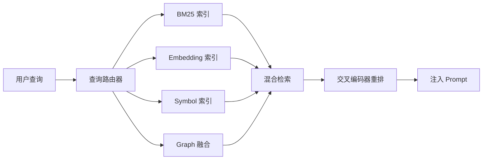
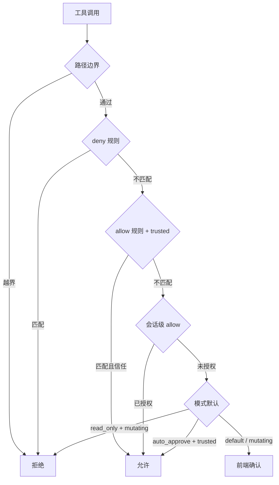

# godot-for-agent

> Godot 内嵌 AI 游戏开发 Agent 的完整工程。仓库包含需求/架构文档、Python 本地 LLM 服务，以及 Godot 4 编辑器插件前端。

目标是把 AI 助手放进 Godot 编辑器里：读取工程上下文、检索代码、调用大模型、多智能体分工、预览并确认改动、通过 UndoRedo 撤销，并逐步支持 AI 自测、运行时诊断、草图转关卡和资产理解能力。

<!-- 📸 在此处插入项目总览截图 -->
<!--  -->

---

## 目录

- [godot-for-agent](#godot-for-agent)
  - [目录](#目录)
  - [仓库结构](#仓库结构)
  - [功能总览](#功能总览)
  - [后端服务 (`ai_agent_service`)](#后端服务-ai_agent_service)
    - [后端快速启动](#后端快速启动)
    - [API 端点一览](#api-端点一览)
      - [`/chat` 请求体](#chat-请求体)
      - [`/chat` 三态响应](#chat-三态响应)
      - [可用命令](#可用命令)
    - [环境变量完整参考](#环境变量完整参考)
      - [LLM 配置](#llm-配置)
      - [Thinking 预算](#thinking-预算)
      - [项目 \& 运行配置](#项目--运行配置)
      - [权限 \& 安全](#权限--安全)
      - [存储路径](#存储路径)
      - [RAG \& Embedding](#rag--embedding)
      - [资产理解](#资产理解)
      - [验证系统](#验证系统)
    - [多智能体系统](#多智能体系统)
    - [工具系统](#工具系统)
      - [Server 工具（Python 侧执行）](#server-工具python-侧执行)
      - [Front 工具（Godot 侧执行）](#front-工具godot-侧执行)
    - [RAG 检索系统](#rag-检索系统)
    - [LLM 管理](#llm-管理)
    - [权限与安全](#权限与安全)
      - [权限模式](#权限模式)
      - [权限检查流程](#权限检查流程)
      - [安全规则](#安全规则)
    - [Skill / OutputStyle 扩展](#skill--outputstyle-扩展)
      - [Skill](#skill)
      - [OutputStyle](#outputstyle)
    - [验证系统](#验证系统-1)
    - [会话与恢复](#会话与恢复)
    - [MCP 服务器](#mcp-服务器)
    - [记忆系统](#记忆系统)
    - [Doctor 自检](#doctor-自检)
  - [前端插件 (`ai_agent_frontend`)](#前端插件-ai_agent_frontend)
    - [安装与启用](#安装与启用)
    - [UI 面板](#ui-面板)
    - [上下文采集](#上下文采集)
    - [前端工具](#前端工具)
    - [UndoRedo 集成](#undoredo-集成)
    - [恢复提示](#恢复提示)
    - [EditorSettings 完整参考](#editorsettings-完整参考)
      - [服务连接](#服务连接)
      - [会话 \& UI](#会话--ui)
      - [LLM 配置](#llm-配置-1)
      - [RAG \& Embedding](#rag--embedding-1)
      - [资产理解](#资产理解-1)
      - [日志 \& 事件](#日志--事件)
      - [测试 \& Headless](#测试--headless)
  - [安全模型](#安全模型)
  - [开发自检](#开发自检)
  - [故障排查](#故障排查)

---

## 仓库结构

| 路径 | 说明 |
| --- | --- |
| `ai_map_agent/` | 需求文档、Python 服务架构方案、GDScript 前端架构方案和详细设计文档 |
| `ai_agent_service/` | FastAPI 本地服务，负责 LLM 调用、Agent 编排、权限闸、RAG、Skill、MCP 等 |
| `ai_agent_frontend/` | Godot 4 EditorPlugin 前端，负责编辑器 UI、上下文采集、预览确认和 UndoRedo |

```text
godot-for-agent/
├── ai_map_agent/              # 需求/架构/详设文档
├── ai_agent_service/          # Python 后端
│   ├── app/
│   │   ├── agents/            # Agent 定义 (markdown frontmatter)
│   │   │   └── agent_defs/    # coordinator, programming-agent, scene-agent, map-agent, resource-agent, advisor
│   │   ├── api/               # FastAPI 路由 & DTO
│   │   ├── doctor/            # 服务自检
│   │   ├── events/            # 实时事件存储
│   │   ├── llm/               # LLM Provider / Prompt 缓存 / 消息变换
│   │   ├── lsp/               # LSP 状态
│   │   ├── mcp/               # MCP stdio 服务器
│   │   ├── memory/            # 项目级记忆
│   │   ├── orchestrator/      # Agent 编排器
│   │   ├── output_styles/     # OutputStyle 目录扫描
│   │   ├── permissions/       # 权限引擎 & 规则
│   │   ├── prompt/            # Prompt 构建 / RAG 上下文注入
│   │   ├── query/             # 查询引擎（turn 管理）
│   │   ├── rag/               # RAG 索引 / 混合检索 / 图融合 / 重排
│   │   │   └── engine/        # 资产索引 / 场景图索引 / 信号图索引
│   │   ├── recovery/          # 崩溃恢复指针
│   │   ├── security/          # 路径沙箱 & 安全配置
│   │   ├── sessions/          # 会话持久化
│   │   ├── skills/            # Skill 目录扫描
│   │   ├── tools/             # 工具注册表
│   │   │   └── server_tools/  # 服务端工具实现 (read_file, grep_code, list_files, search_codebase, search_tools, load_skill)
│   │   └── verify/            # 编辑后语法/语义校验
│   ├── tests/
│   └── pyproject.toml
└── ai_agent_frontend/         # Godot 4 前端插件
    └── addons/ai_agent/
        ├── config/            # EditorSettings 迁移
        ├── context/           # 上下文采集 (场景树/诊断/文件缓存/ClassDB)
        ├── dto/               # GDScript DTO
        ├── logging/           # 前端日志
        ├── recovery/          # 恢复指针
        ├── service/           # HTTP 客户端 & 服务管理器
        ├── state/             # Agent 事件日志 & 状态存储
        ├── tools/             # 前端工具 (map/scene/resource/program)
        ├── ui/                # 聊天面板/命令面板/Doctor/Memory/扩展/预览确认/恢复提示/Markdown 渲染
        └── undo/              # 统一 UndoRedo 管理
```

---

## 功能总览

| 领域 | 能力 |
| --- | --- |
| **对话** | `/chat` 三态响应（`tool_calls` / `final` / `error`）、SSE 事件流轮询、中断、丢弃 pending、会话重置 |
| **多智能体** | 6 个专业 Agent + `delegate` / `delegate_many` 委派 + `create_plan` 计划 |
| **工具** | 30+ 前端/服务端工具，统一注册、权限闸、预览确认、UndoRedo |
| **RAG** | BM25 基线 + 可选 Embedding(FAISS) + Symbol + 场景图/信号图 + 混合检索 + 交叉编码器重排 + 查询路由 |
| **LLM** | OpenAI 兼容、5 级 effort 模型、thinking 预算、fallback 降级、prompt 缓存（三级降级） |
| **安全** | 路径沙箱、4 种权限模式、信任模型、deny/allow 规则、会话级 allow、预览确认 |
| **验证** | 编辑后自动语法快检 (Godot CLI) + LLM 语义校验 + 自动修复重试 |
| **扩展** | Skill / OutputStyle / 自定义 Agent（markdown frontmatter 模式） |
| **记忆** | 项目级 JSON 持久化记忆（`/memory` GET/POST） |
| **恢复** | 崩溃恢复指针（`/recovery-pointer`），前端检测后提示恢复 |
| **MCP** | `python -m app --mcp-stdio` 提供只读/服务端工具的 stdio JSON-RPC 入口 |
| **Doctor** | 服务自检（`/doctor`）：LLM 连通性、工具注册、Skill/OutputStyle/Memory 状态 |
| **前端 UI** | 聊天面板、命令面板、Doctor 面板、Memory 面板、扩展面板、预览确认、内联工具确认、恢复提示 |
| **M3** | Headless 自测、运行时状态读取、Profiler 快照、图片元数据、图片网格绘制 TileMap、精灵表生成 SpriteFrames、内容文件生成 |

<!-- 📸 在此处插入功能演示 GIF -->
<!--  -->

---

## 后端服务 (`ai_agent_service`)

### 后端快速启动

需要 Python 3.10+。

```powershell
cd ai_agent_service
python -m venv .venv
.\.venv\Scripts\Activate.ps1
python -m pip install -e .
```

开发时建议显式设置端口和 token：

```powershell
$env:AI_AGENT_PROJECT_ROOT = (Resolve-Path ..).Path
$env:AI_AGENT_PORT = "8765"
$env:AI_AGENT_AUTH_TOKEN = "dev-token"
$env:AI_AGENT_LLM_BASE_URL = "https://api.openai.com/v1"
$env:AI_AGENT_LLM_API_KEY = "<your-key>"
$env:AI_AGENT_LLM_MODEL = "gpt-4o-mini"
python -m app
```

<!-- 📸 在此处插入后端启动终端截图 -->
<!--  -->

### API 端点一览

| 方法 | 路径 | 说明 |
| --- | --- | --- |
| `POST` | `/chat` | 主对话入口：发送用户消息或回传工具结果，三态响应 |
| `GET` | `/health` | 健康检查：模型名、端点可达性、function calling 支持 |
| `POST` | `/reset` | 重置指定 session |
| `POST` | `/chat/discard-pending` | 丢弃 session 中 pending 的工具调用 |
| `POST` | `/chat/interrupt` | 中断当前 session 的 agent 执行 |
| `GET` | `/doctor` | 服务自检报告 |
| `GET` | `/skills` | 列出已注册的 Skill |
| `GET` | `/output-styles` | 列出已注册的 OutputStyle |
| `GET` | `/chat/events` | 事件流轮询（长轮询，`session_id` + `after` seq） |
| `GET` | `/sessions/{session_id}/history` | 获取会话历史消息 |
| `GET` | `/recovery-pointer` | 读取崩溃恢复指针 |
| `GET` | `/commands` | 列出可用命令 |
| `POST` | `/commands/{name}` | 执行命令（`doctor` / `rebuild_index` / `compact` / `set_effort` / `set_output_style` / `refresh_extensions`） |
| `GET` | `/memory` | 读取项目级记忆 |
| `POST` | `/memory` | 写入/更新记忆条目 |

所有端点（除 `/health` 可选外）需在请求头中携带 Bearer token：

```http
Authorization: Bearer <your-token>
```

#### `/chat` 请求体

```jsonc
{
  "session_id": "uuid-string",
  "user_message": "帮我创建一个玩家角色脚本",     // 与 tool_results 二选一
  "tool_results": [],                             // 回传前端工具执行结果
  "context": {                                    // 前端采集的结构化上下文
    "selection": {},
    "scene_tree": {},
    "tile_catalog": [],
    "project_files": [],
    "debugger_errors": [],
    "diagnostics": [],
    "dotnet_enabled": false
  },
  "permission_mode": "default",                   // 可选：default/plan/auto_approve/read_only
  "effort": "standard",                           // 可选：quick/standard/deep/verify/advisor
  "output_style": "default"                       // 可选：OutputStyle 名称
}
```

#### `/chat` 三态响应

```jsonc
// 1. tool_calls — 需要前端执行工具
{
  "status": "tool_calls",
  "tool_calls": [
    {
      "tool_use_id": "call_xxx",
      "frame_id": "f1",
      "name": "propose_script_edit",
      "args": { "file_path": "res://scripts/player.gd", "diff": "..." }
    }
  ],
  "turn_id": "turn-xxx"
}

// 2. final — 最终文本回复
{
  "status": "final",
  "message": "已为你创建了玩家角色脚本...",
  "turn_id": "turn-xxx"
}

// 3. error — 出错
{
  "status": "error",
  "error_code": "llm_unreachable",
  "error_message": "..."
}
```

#### 可用命令

| 命令 | 说明 | 参数 |
| --- | --- | --- |
| `doctor` | 返回当前服务自检报告 | 无 |
| `rebuild_index` | 重建本地 RAG 检索索引 | `include`（glob，默认 `**/*`）、`max_files`（默认 4000） |
| `compact` | 压缩指定 session 的早期上下文 | `session_id` |
| `set_effort` | 设置当前 session 的 effort 档位 | `effort`（quick/standard/deep/verify/advisor） |
| `set_output_style` | 设置当前 session 的 OutputStyle | `output_style`（样式名） |
| `refresh_extensions` | 重新扫描 Skill 与 OutputStyle 目录 | 无 |

健康检查示例：

```powershell
Invoke-RestMethod `
  -Uri http://127.0.0.1:8765/doctor `
  -Headers @{ Authorization = "Bearer dev-token" }
```

重建本地 RAG 索引：

```powershell
Invoke-RestMethod `
  -Method Post `
  -Uri http://127.0.0.1:8765/commands/rebuild_index `
  -Headers @{ Authorization = "Bearer dev-token" } `
  -ContentType "application/json" `
  -Body '{"args":{"include":"**/*","max_files":4000}}'
```

---

### 环境变量完整参考

所有变量均可通过 `AI_AGENT_` 前缀的环境变量或工作目录下的 `.env` 文件配置。

#### LLM 配置

| 环境变量 | 默认值 | 说明 |
| --- | --- | --- |
| `AI_AGENT_LLM_BASE_URL` | `https://api.openai.com/v1` | OpenAI 兼容 Chat Completions 端点 |
| `AI_AGENT_LLM_API_KEY` | *(空)* | 大模型 API key（`SecretStr`，不泄露到日志/响应） |
| `AI_AGENT_LLM_MODEL` | `gpt-4o-mini` | 默认对话模型 |
| `AI_AGENT_LLM_QUICK_MODEL` | *(空=用 llm_model)* | quick effort 模型 |
| `AI_AGENT_LLM_STANDARD_MODEL` | *(空=用 llm_model)* | standard effort 模型 |
| `AI_AGENT_LLM_DEEP_MODEL` | *(空=用 llm_model)* | deep effort 模型 |
| `AI_AGENT_LLM_VERIFY_MODEL` | *(空=用 llm_model)* | verify effort 模型 |
| `AI_AGENT_LLM_ADVISOR_MODEL` | *(空=用 llm_model)* | advisor effort 模型 |
| `AI_AGENT_LLM_FALLBACK_MODEL` | *(空=不降级)* | 主模型不可用时的降级模型 |
| `AI_AGENT_LLM_REQUEST_TIMEOUT_S` | `60.0` | 单次 LLM 请求超时（秒） |

#### Thinking 预算

| 环境变量 | 默认值 | 说明 |
| --- | --- | --- |
| `AI_AGENT_LLM_THINKING_BUDGET_QUICK` | `1024` | quick effort 的 thinking token 预算 |
| `AI_AGENT_LLM_THINKING_BUDGET_STANDARD` | `4096` | standard effort 的 thinking token 预算 |
| `AI_AGENT_LLM_THINKING_BUDGET_DEEP` | `16384` | deep effort 的 thinking token 预算 |
| `AI_AGENT_LLM_THINKING_BUDGET_VERIFY` | `0` | verify effort 的 thinking token 预算（0=关闭 thinking） |
| `AI_AGENT_LLM_THINKING_BUDGET_ADVISOR` | `2048` | advisor effort 的 thinking token 预算 |

#### 项目 & 运行配置

| 环境变量 | 默认值 | 说明 |
| --- | --- | --- |
| `AI_AGENT_PROJECT_ROOT` | `cwd` | 当前 Godot 工程根目录 |
| `AI_AGENT_HOST` | `127.0.0.1` | 绑定地址（仅本机回环） |
| `AI_AGENT_PORT` | `0` | 监听端口；`0` = 操作系统随机分配 |
| `AI_AGENT_LOG_LEVEL` | `DEBUG` | 日志等级：DEBUG/INFO/WARNING/ERROR/CRITICAL |
| `AI_AGENT_LOG_DIR` | `logs` | 日志文件存储目录 |
| `AI_AGENT_MAX_TURNS` | `36` | 单次消息的 agent 循环全局上限 |

#### 权限 & 安全

| 环境变量 | 默认值 | 说明 |
| --- | --- | --- |
| `AI_AGENT_PERMISSION_MODE` | `default` | 会话初始权限模式：`default` / `plan` / `auto_approve` / `read_only` |
| `AI_AGENT_TRUSTED_PROJECT` | `false` | 工程是否已被用户标记为受信任 |
| `AI_AGENT_DENY_RULES` | `[]` | 显式 deny 规则（JSON 数组，始终生效） |
| `AI_AGENT_ALLOW_RULES` | `[]` | 显式 allow 规则（JSON 数组，仅 trusted 生效） |

#### 存储路径

| 环境变量 | 默认值 | 说明 |
| --- | --- | --- |
| `AI_AGENT_SESSION_STORE_DIR` | `.ai_agent_service/sessions` | 会话本地持久化目录 |
| `AI_AGENT_RECOVERY_POINTER_PATH` | `.ai_agent_service/recovery_pointer.json` | 最小恢复指针路径 |
| `AI_AGENT_MEMORY_STORE_PATH` | `.ai_agent_service/memory.json` | 项目本地记忆存储 |
| `AI_AGENT_RAG_INDEX_PATH` | `.ai_agent_service/rag_index.json` | 本地 RAG 索引路径 |
| `AI_AGENT_USER_SKILLS_DIR` | `~/.ai_agent/skills` | 用户级 Skill 目录 |
| `AI_AGENT_PROJECT_SKILLS_DIR` | `.ai_agent/skills` | 项目级 Skill 目录 |
| `AI_AGENT_OUTPUT_STYLES_DIR` | `.ai_agent/output_styles` | 项目级 OutputStyle 目录 |

#### RAG & Embedding

| 环境变量 | 默认值 | 说明 |
| --- | --- | --- |
| `AI_AGENT_EMBEDDING_PROVIDER` | `disabled` | Embedding 提供方：`disabled` / `openai` / `local` / `bge-m3` |
| `AI_AGENT_EMBEDDING_MODEL` | `text-embedding-3-small` | Embedding 模型名 |
| `AI_AGENT_EMBEDDING_ENDPOINT` | `https://api.openai.com/v1` | Embedding API 端点 |
| `AI_AGENT_EMBEDDING_API_KEY` | *(空)* | Embedding API key |
| `AI_AGENT_EMBEDDING_TIMEOUT_S` | `3.0` | Embedding 请求超时（秒，上限 3.0） |
| `AI_AGENT_EMBEDDING_RETRIES` | `1` | Embedding 重试次数（上限 2） |
| `AI_AGENT_RERANK_MODEL` | *(空=跳过)* | 交叉编码器重排模型名 |
| `AI_AGENT_RERANK_TIMEOUT_S` | `2.0` | 重排请求超时（秒，上限 2.0） |
| `AI_AGENT_RAG_QUERY_ROUTER_ENABLED` | `true` | 是否启用查询路由 |
| `AI_AGENT_RAG_TOKEN_BUDGET` | `1500` | RAG 注入 prompt 的 token 预算（下限 128） |
| `AI_AGENT_GRAPH_MAX_DEPTH` | `2` | 图检索最大深度（0–8） |
| `AI_AGENT_GRAPH_MAX_NEIGHBORS` | `5` | 图检索每节点最大邻居数（1–100） |

#### 资产理解

| 环境变量 | 默认值 | 说明 |
| --- | --- | --- |
| `AI_AGENT_ASSET_UNDERSTANDING_ENABLED` | `false` | 是否启用资产理解（图片→描述） |
| `AI_AGENT_ASSET_UNDERSTANDING_MODEL` | *(空)* | 资产理解模型名 |
| `AI_AGENT_ASSET_UNDERSTANDING_ENDPOINT` | *(空)* | 资产理解 API 端点 |
| `AI_AGENT_ASSET_UNDERSTANDING_API_KEY` | *(空)* | 资产理解 API key |
| `AI_AGENT_ASSET_UNDERSTANDING_TIMEOUT_S` | `10.0` | 资产理解请求超时（秒） |
| `AI_AGENT_ASSET_UNDERSTANDING_MAX_TOKENS` | `500` | 资产理解最大输出 token |

#### 验证系统

| 环境变量 | 默认值 | 说明 |
| --- | --- | --- |
| `AI_AGENT_VERIFY_AFTER_EDIT` | `true` | 编辑类工具落地后是否自动触发校验 |
| `AI_AGENT_VERIFY_TRIGGER_TOOLS` | `["propose_script_edit","write_file","apply_text_edit","propose_tests","propose_content_file"]` | 触发自动校验的工具名集合（JSON 数组） |
| `AI_AGENT_VERIFY_SYNTAX_ENABLED` | `true` | 是否启用 Phase 1 语法快检 |
| `AI_AGENT_VERIFY_SYNTAX_TIMEOUT` | `10` | Phase 1 语法快检超时（秒） |
| `AI_AGENT_VERIFY_GODOT_PATH` | `godot` | Godot 可执行文件路径 |
| `AI_AGENT_VERIFY_EFFORT` | `verify` | Phase 2 语义校验使用的 effort 档位 |
| `AI_AGENT_VERIFY_MAX_RETRIES` | `2` | 单次编辑允许的最大校验-修复重试次数 |

---

### 多智能体系统

采用 Claude Code 同构的 **markdown frontmatter + body** 模型定义 Agent。每个 Agent 文件位于 `app/agents/agent_defs/*.md`。

| Agent | 角色 | Effort | 最大轮数 | 核心能力 |
| --- | --- | --- | --- | --- |
| **coordinator** | 主控协调者 | standard | 12 | 所有工具 + `delegate` / `delegate_many` / `create_plan` |
| **programming-agent** | 代码专家 | deep | 10 | 脚本编写、调试、测试、重构 |
| **scene-agent** | 场景专家 | standard | 8 | 场景树操作、节点属性、信号连接 |
| **map-agent** | 地图专家 | standard | 8 | TileMap 编辑、关卡绘制、瓦片填充 |
| **resource-agent** | 资源专家 | standard | 8 | 资源创建、精灵表、内容文件 |
| **advisor** | 只读顾问 | advisor | 10 | 架构分析、设计建议、问题诊断（不写工程） |

**Agent 帧（Frame）模型**：每次对话创建根帧（coordinator），委派时创建子帧，子帧有独立消息上下文、独立轮数预算，执行完毕后结果回流父帧。

**Effort 档位**：`quick` / `standard` / `deep` / `verify` / `advisor`，每档可独立配置模型和 thinking 预算。

<!-- 📸 在此处插入 Agent 委派流程图或截图 -->
<!--  -->

---

### 工具系统

工具分为 **server**（Python 侧执行）和 **front**（Godot 侧执行），统一在 `app/tools/registry.py` 注册。每个 `ToolDef` 携带：

- `side`：`server` 或 `front`
- `domain`：`core` / `program` / `scene` / `map` / `resource`
- 风险元数据：`reads_project` / `writes_project` / `executes_process` / `uses_network`
- `needs_preview`：是否需要前端预览确认
- `render_kind`：前端渲染类型（`diff` / `list` / `run` / `log` / `map` 等）
- `path_args` / `read_path_args` / `write_path_args`：路径参数声明
- `deferred`：是否延迟加载（M2+ 由 `search_tools` 按需发现）

#### Server 工具（Python 侧执行）

| 工具名 | 域 | 说明 |
| --- | --- | --- |
| `read_file` | core | 读取工程内文件 |
| `grep_code` | core | 在工程内正则搜索 |
| `list_files` | core | 列出工程内文件 |
| `search_codebase` | core | RAG 代码检索 |
| `search_tools` | core | 按关键词发现 deferred 工具 |
| `load_skill` | core | 加载指定 Skill 的 markdown 内容 |

#### Front 工具（Godot 侧执行）

| 工具名 | 域 | 写工程 | 执行进程 | 说明 |
| --- | --- | --- | --- | --- |
| `delegate` | core | ✗ | ✗ | 委派任务给子 Agent |
| `delegate_many` | core | ✗ | ✗ | 并行委派多个子 Agent |
| `create_plan` | core | ✗ | ✗ | 创建结构化执行计划 |
| `propose_script_edit` | program | ✓ | ✗ | 提议脚本 diff 编辑 |
| `propose_tests` | program | ✓ | ✗ | 提议测试代码 |
| `apply_text_edit` | program | ✓ | ✗ | 应用文本编辑 |
| `write_file` | program | ✓ | ✗ | 写入文件 |
| `read_class_docs` | program | ✗ | ✗ | 读取 ClassDB 文档 |
| `read_debugger_errors` | program | ✗ | ✗ | 读取调试器错误 |
| `read_runtime_state` | program | ✗ | ✗ | 读取运行时节点状态 |
| `read_profiler_snapshot` | program | ✗ | ✗ | 读取 Profiler 快照 |
| `run_tests` | program | ✗ | ✓ | 运行项目测试 |
| `run_headless_self_test` | program | ✗ | ✓ | Headless 自测 |
| `read_scene_tree` | scene | ✗ | ✗ | 读取场景树结构 |
| `add_node` | scene | ✓ | ✗ | 添加场景节点 |
| `set_node_property` | scene | ✓ | ✗ | 设置节点属性 |
| `describe_tilemap_selection` | map | ✗ | ✗ | 描述 TileMap 选区 |
| `fill_rect` | map | ✓ | ✗ | 填充 TileMap 矩形区域 |
| `paint_from_image_grid` | map | ✓ | ✗ | 从图片网格绘制 TileMap |
| `create_resource` | resource | ✓ | ✗ | 创建 Godot 资源 |
| `read_image_metadata` | resource | ✗ | ✗ | 读取图片元数据 |
| `create_sprite_frames_from_sheet` | resource | ✓ | ✗ | 精灵表生成 SpriteFrames |
| `propose_content_file` | resource | ✓ | ✗ | 生成内容文件 |

<!-- 📸 在此处插入工具预览确认截图 -->
<!--  -->

---

### RAG 检索系统



| 组件 | 说明 |
| --- | --- |
| **BM25 索引** | 本地 TF-IDF 风格索引，`rebuild_index` 命令重建 |
| **Embedding 索引** | 可选 FAISS 向量索引，支持 `openai` / `local` / `bge-m3` |
| **Symbol 索引** | 代码符号级检索（类、函数、变量） |
| **场景图索引** | 场景树结构、节点关系 |
| **信号图索引** | 信号定义、连接关系 |
| **资产索引** | 图片/资源元数据 |
| **混合检索** | 融合多检索器结果 |
| **图融合** | 利用图结构扩展相关节点 |
| **查询路由器** | 智能分发查询到最合适的检索器 |
| **交叉编码器重排** | 可选的二次精排（`rerank_model` 配置） |

---

### LLM 管理

- **OpenAI 兼容**：通过 `base_url` / `api_key` / `model` 接入任意兼容端点
- **5 级 Effort**：每级可独立配置模型和 thinking 预算
- **Fallback 降级**：主模型不可用时自动切换到 `llm_fallback_model`
- **Prompt 缓存**：三级降级策略（显式缓存控制 → 隐式前缀稳定 → 无缓存）
- **流式响应**：支持 SSE 流式输出

---

### 权限与安全

#### 权限模式

| 模式 | 行为 |
| --- | --- |
| `default` | 写工程/执行进程需前端确认，只读工具自动放行 |
| `plan` | 只生成计划，不执行任何工具 |
| `auto_approve` | 自动批准所有工具（未信任工程降级为 default） |
| `read_only` | 只允许只读工具 |

#### 权限检查流程



#### 安全规则

- 默认只绑定 `127.0.0.1`，HTTP 请求需 Bearer token
- server 工具只能访问 `AI_AGENT_PROJECT_ROOT` 内路径
- `.git/`、`.godot/` 默认禁止读写，`addons/` 默认禁止写入
- 所有写工程和执行进程的工具必须经前端确认
- `run_tests`、`run_headless_self_test` 只读取本地 EditorSettings 配置，模型不能传任意命令
- Agent、Skill、OutputStyle 只是提示词/配置资产，不能授予新权限

---

### Skill / OutputStyle 扩展

#### Skill

Markdown frontmatter + body 格式，每个 Skill 一个子目录：

```text
~/.ai_agent/skills/         # 用户级
.ai_agent/skills/            # 项目级（未信任工程不启用）
```

```markdown
---
name: my-skill
description: 一句话描述
tags: [godot, gameplay]
---

# My Skill

具体指令...
```

#### OutputStyle

```text
.ai_agent/output_styles/    # 项目级
```

```markdown
---
name: concise
description: 简洁输出风格
---

回复规则...
```

内置 OutputStyle：`default` / `concise` / `review`。

通过 `/commands/set_output_style` 或 `/chat` 请求的 `output_style` 字段切换。

---

### 验证系统

编辑类工具（`propose_script_edit`、`write_file`、`apply_text_edit`、`propose_tests`、`propose_content_file`）成功落地后自动触发两阶段校验：

| 阶段 | 方式 | 说明 |
| --- | --- | --- |
| **Phase 1** | Godot CLI 语法快检 | `godot --headless --check-only`，超时 10 秒 |
| **Phase 2** | LLM 语义校验 | 使用 `verify` effort，分析上下文一致性 |

校验失败时自动尝试修复，单文件最多重试 `verify_max_retries`（默认 2）次。

---

### 会话与恢复

- **会话持久化**：`session_store_dir` 目录下按 session_id 存储对话历史
- **恢复指针**：`recovery_pointer.json` 记录最后事件序号和 pending turn
- **前端检测**：插件启动时读取恢复指针，若存在且 `project_hash` 匹配则提示用户恢复
- **压缩**：`compact` 命令压缩早期上下文，保留 pending 和 agent_stack

---

### MCP 服务器

```powershell
'{"jsonrpc":"2.0","id":1,"method":"tools/list","params":{}}' | python -m app --mcp-stdio
```

提供只读/服务端工具的 stdio JSON-RPC 入口，适合外部 IDE 或 CLI 集成。

---

### 记忆系统

- **存储**：项目级 JSON 文件（`memory_store_path`）
- **读写**：`GET /memory` 读取、`POST /memory` 写入
- **不保存**：token、API key 或完整敏感对话
- **前端面板**：Memory 面板可视化查看

---

### Doctor 自检

`GET /doctor` 返回：

- LLM 端点连通性
- 认证状态
- 已注册工具列表
- Skill / OutputStyle 状态
- 记忆存储状态
- 安全配置告警

---

## 前端插件 (`ai_agent_frontend`)

### 安装与启用

`ai_agent_frontend/` 是独立 Godot 插件工程。实际使用时，把插件目录复制或软链接到目标 Godot 项目的 `addons/` 下：

```text
<your-godot-project>/
  addons/
    ai_agent/
```

然后在 Godot 中启用插件：

```text
Project > Project Settings > Plugins > AI Agent
```

推荐先使用插件的自动启动模式，这样 token 会通过 stdin 传给 Python 服务，不会出现在命令行参数里。

<!-- 📸 在此处插入插件启用截图 -->
<!--  -->

---

### UI 面板

| 面板 | 文件 | 说明 |
| --- | --- | --- |
| **聊天面板** | `chat_panel.gd` | 主对话界面，支持 Markdown 渲染、代码高亮、工具预览卡片 |
| **命令面板** | `command_palette.gd` | `/` 触发的命令快捷入口 |
| **Doctor 面板** | `doctor_panel.gd` | 服务自检结果可视化 |
| **Memory 面板** | `memory_panel.gd` | 项目记忆查看/管理 |
| **扩展面板** | `extension_panel.gd` | Skill / OutputStyle 浏览与切换 |
| **预览确认面板** | `preview_confirm_panel.gd` | 写工具的 diff 预览与确认/拒绝 |
| **内联工具确认** | `inline_tool_confirmation.gd` | 聊天流中的内联工具确认卡片 |
| **恢复提示** | `recovery_prompt.gd` | 崩溃恢复提示对话框 |

辅助渲染：

| 组件 | 文件 | 说明 |
| --- | --- | --- |
| **Markdown 渲染器** | `markdown_renderer.gd` | Markdown → RichTextLabel BBCode |
| **工具预览渲染器** | `tool_preview_renderer.gd` | 工具 diff/列表/日志的预览渲染 |
| **日志条目渲染器** | `log_entry_renderer.gd` | Agent 事件日志条目渲染 |
| **事件格式化器** | `event_formatter.gd` | 事件类型 → 可读文本 |
| **聊天面板主题** | `chat_panel_theme.gd` | 聊天面板主题/配色 |
| **聊天面板文本** | `chat_panel_text.gd` | 文本处理/复制/选择 |

<!-- 📸 在此处插入聊天面板截图 -->
<!--  -->

<!-- 📸 在此处插入命令面板截图 -->
<!--  -->

<!-- 📸 在此处插入 Doctor 面板截图 -->
<!--  -->

<!-- 📸 在此处插入预览确认截图 -->
<!--  -->

<!-- 📸 在此处插入扩展面板截图 -->
<!--  -->

<!-- 📸 在此处插入 Memory 面板截图 -->
<!--  -->

---

### 上下文采集

| 采集器 | 文件 | 说明 |
| --- | --- | --- |
| **上下文采集器** | `context_collector.gd` | 汇总当前选区、场景树、项目文件等 |
| **ClassDB 阅读器** | `classdb_reader.gd` | 读取 Godot 内置类文档 |
| **诊断采集器** | `diagnostics_collector.gd` | 采集编辑器诊断错误/警告 |
| **文件状态缓存** | `file_state_cache.gd` | 缓存已读文件内容，避免重复 IO |

每轮对话时，前端自动采集上下文并通过 `ChatRequest.context` 发送给后端。

---

### 前端工具

| 模块 | 文件 | 工具 |
| --- | --- | --- |
| **工具执行器** | `tool_executor.gd` | 接收后端 `tool_calls`，分发到对应模块执行 |
| **编程工具** | `program_tools.gd` | `propose_script_edit`、`write_file`、`apply_text_edit`、`propose_tests` |
| **场景工具** | `scene_tools.gd` | `read_scene_tree`、`add_node`、`set_node_property` |
| **地图工具** | `map_tools.gd` | `describe_tilemap_selection`、`fill_rect`、`paint_from_image_grid` |
| **资源工具** | `resource_tools.gd` | `create_resource`、`read_image_metadata`、`create_sprite_frames_from_sheet`、`propose_content_file` |
| **路径工具** | `path_utils.gd` | `res://` ↔ 绝对路径互转 |

---

### UndoRedo 集成

`unified_undo_manager.gd` 将所有写操作包装为 Godot `UndoRedo` action：

- 每个写工具执行前创建 action
- 记录旧文件内容 / 旧场景状态
- 用户可通过 `Ctrl+Z` 撤销 AI 的任何改动
- 支持跨工具的统一撤销栈

---

### 恢复提示

`recovery_pointer.gd` 在每次事件后更新恢复指针。插件启动时：

1. 读取 `/recovery-pointer`
2. 校验 `project_hash` 是否匹配当前工程
3. 若匹配则弹出恢复提示，用户可选择恢复或重新开始

---

### EditorSettings 完整参考

在 Godot 编辑器中通过 `Edit > Editor Settings > Ai Agent` 配置：

#### 服务连接

| EditorSettings key | 类型 | 默认值 | 说明 |
| --- | --- | --- | --- |
| `ai_agent/service_url` | string | `http://127.0.0.1:8765` | 服务地址 |
| `ai_agent/auto_start_service` | bool | `false` | 是否由插件自动启动 Python 服务 |
| `ai_agent/python_executable` | string | *(空=自动检测)* | Python 可执行文件路径 |
| `ai_agent/service_module_dir` | string | *(空)* | `ai_agent_service` 目录的绝对路径 |

#### 会话 & UI

| EditorSettings key | 类型 | 默认值 | 说明 |
| --- | --- | --- | --- |
| `ai_agent/session_id` | string | `default` | 当前会话 ID |
| `ai_agent/ui_language` | string | `zh` | UI 语言（`zh` / `en`） |
| `ai_agent/permission_mode` | string | `default` | 权限模式：`default` / `plan` / `auto_approve` / `read_only` |
| `ai_agent/effort` | string | `standard` | Effort 档位：`quick` / `standard` / `deep` / `verify` / `advisor` |
| `ai_agent/output_style` | string | `default` | OutputStyle 名称 |
| `ai_agent/trusted_project_extensions` | bool | `false` | 是否信任项目扩展（允许项目级 Skill） |
| `ai_agent/show_recovery_prompt` | bool | `true` | 是否显示崩溃恢复提示 |
| `ai_agent/session_history_json` | string | *(空)* | 会话历史 JSON（内部缓存） |

#### LLM 配置

| EditorSettings key | 类型 | 默认值 | 说明 |
| --- | --- | --- | --- |
| `ai_agent/llm_base_url` | string | `https://api.openai.com/v1` | OpenAI 兼容 Chat Completions 端点 |
| `ai_agent/llm_api_key` | string | *(空)* | 大模型 API key |
| `ai_agent/llm_model` | string | `gpt-4o-mini` | 默认对话模型 |
| `ai_agent/llm_quick_model` | string | *(空=用 llm_model)* | quick effort 模型 |
| `ai_agent/llm_standard_model` | string | *(空=用 llm_model)* | standard effort 模型 |
| `ai_agent/llm_deep_model` | string | *(空=用 llm_model)* | deep effort 模型 |
| `ai_agent/llm_verify_model` | string | *(空=用 llm_model)* | verify effort 模型 |
| `ai_agent/llm_advisor_model` | string | *(空=用 llm_model)* | advisor effort 模型 |
| `ai_agent/llm_fallback_model` | string | *(空=不降级)* | 主模型不可用时的降级模型 |
| `ai_agent/llm_request_timeout_s` | float | `60.0` | 单次 LLM 请求超时（秒） |

#### RAG & Embedding

| EditorSettings key | 类型 | 默认值 | 说明 |
| --- | --- | --- | --- |
| `ai_agent/embedding_provider` | string | `disabled` | Embedding 提供方：`disabled` / `openai` / `local` / `bge-m3` |
| `ai_agent/embedding_model` | string | `text-embedding-3-small` | Embedding 模型名 |
| `ai_agent/embedding_endpoint` | string | `https://api.openai.com/v1` | Embedding API 端点 |
| `ai_agent/embedding_api_key` | string | *(空)* | Embedding API key |
| `ai_agent/embedding_timeout_s` | float | `3.0` | Embedding 请求超时（秒） |
| `ai_agent/embedding_retries` | int | `1` | Embedding 重试次数 |
| `ai_agent/rerank_model` | string | *(空=跳过)* | 交叉编码器重排模型名 |
| `ai_agent/rerank_timeout_s` | float | `2.0` | 重排请求超时（秒） |
| `ai_agent/rag_query_router_enabled` | bool | `true` | 是否启用查询路由 |
| `ai_agent/rag_token_budget` | int | `1500` | RAG 注入 prompt 的 token 预算 |
| `ai_agent/graph_max_depth` | int | `2` | 图检索最大深度 |
| `ai_agent/graph_max_neighbors` | int | `5` | 图检索每节点最大邻居数 |

#### 资产理解

| EditorSettings key | 类型 | 默认值 | 说明 |
| --- | --- | --- | --- |
| `ai_agent/asset_understanding_enabled` | bool | `false` | 是否启用资产理解（图片→描述） |
| `ai_agent/asset_understanding_model` | string | *(空)* | 资产理解模型名 |
| `ai_agent/asset_understanding_endpoint` | string | *(空)* | 资产理解 API 端点 |
| `ai_agent/asset_understanding_api_key` | string | *(空)* | 资产理解 API key |
| `ai_agent/asset_understanding_timeout_s` | float | `10.0` | 资产理解请求超时（秒） |
| `ai_agent/asset_understanding_max_tokens` | int | `500` | 资产理解最大输出 token |

#### 日志 & 事件

| EditorSettings key | 类型 | 默认值 | 说明 |
| --- | --- | --- | --- |
| `ai_agent/log_level` | string | `info` | 日志等级：`debug` / `info` / `warning` / `error` |
| `ai_agent/log_to_file` | bool | `true` | 是否写入日志文件 |
| `ai_agent/log_file_path` | string | `res://logs/ai_agent_frontend.log` | 前端日志文件路径 |
| `ai_agent/enable_event_stream` | bool | `true` | 是否启用事件流轮询 |
| `ai_agent/event_poll_interval_sec` | float | `1.0` | 事件轮询间隔（秒） |
| `ai_agent/enable_lsp_diagnostics` | bool | `true` | 是否启用 LSP 诊断采集 |

#### 测试 & Headless

| EditorSettings key | 类型 | 默认值 | 说明 |
| --- | --- | --- | --- |
| `ai_agent/test_executable` | string | *(空)* | 项目测试 runner 可执行文件 |
| `ai_agent/test_args` | string | *(空)* | 测试 runner 参数 |
| `ai_agent/test_output_log` | string | *(空)* | 测试输出日志路径 |
| `ai_agent/headless_executable` | string | *(空)* | M3 headless 自测 runner 可执行文件 |
| `ai_agent/headless_args` | string | *(空)* | Headless runner 参数 |
| `ai_agent/headless_output_log` | string | *(空)* | Headless 输出日志路径 |
| `ai_agent/runner_timeout_ms` | int | `120000` | Runner 超时（毫秒） |

<!-- 📸 在此处插入 EditorSettings 配置截图 -->
<!--  -->

---

## 安全模型

- 默认只绑定本机地址（`127.0.0.1`），HTTP 请求需要 Bearer token
- server 工具只能访问 `AI_AGENT_PROJECT_ROOT` 内路径
- `.git/`、`.godot/` 默认禁止读写，`addons/` 默认禁止写入
- 所有写工程和执行进程的工具必须经前端预览确认
- `run_tests`、`run_headless_self_test` 只读取本地 EditorSettings 中配置的可执行文件和参数，模型不能传任意命令
- Agent、Skill、OutputStyle 只是提示词/配置资产，不能授予新权限，也不能绕过权限闸
- Token 来源：`--token-stdin`（推荐，通过 stdin 传入）、`AI_AGENT_AUTH_TOKEN` 环境变量、或自动生成一次性 token

---

## 开发自检

后端语法检查：

```powershell
cd ai_agent_service
python -m compileall app
```

MCP stdio 快速检查：

```powershell
'{"jsonrpc":"2.0","id":1,"method":"tools/list","params":{}}' | python -m app --mcp-stdio
```

格式空白检查：

```powershell
git diff --check -- ai_agent_service ai_agent_frontend
```

运行测试：

```powershell
cd ai_agent_service
python -m pytest tests/
```

当前本机环境中还需要额外安装/配置后才能运行：

- `python -m mypy app`：需要安装 `mypy`
- Godot GDScript CLI 校验：需要把 `godot` 加入 PATH

---

## 故障排查

| 问题 | 排查 |
| --- | --- |
| LLM 不可达 | 检查 `AI_AGENT_LLM_BASE_URL` 和 `AI_AGENT_LLM_API_KEY`；用 `/doctor` 诊断 |
| 工具被拒绝 | 检查权限模式和路径沙箱；确认 `AI_AGENT_PROJECT_ROOT` 指向正确的工程根目录 |
| 索引为空 | 执行 `/commands/rebuild_index` 重建 RAG 索引 |
| 插件连不上服务 | 检查 `ai_agent/service_url` 和 `ai_agent/auto_start_service`；查看服务是否已启动 |
| Token 不匹配 | 确认前端和后端使用相同的 auth token |
| 恢复提示异常 | 删除 `.ai_agent_service/recovery_pointer.json` 清除恢复指针 |