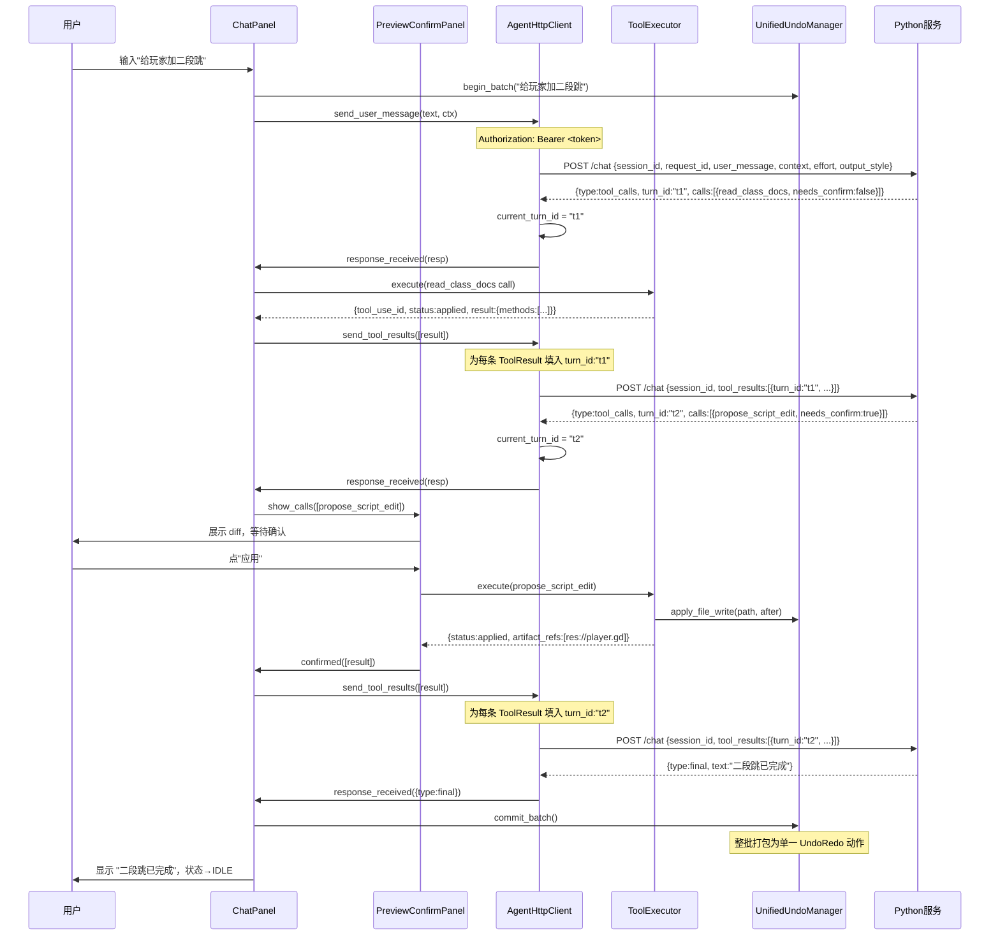

# GDScript 前端架构方案（Godot 编辑器插件）

| 项目 | 内容 |
|------|------|
| 文档名称 | AI 游戏开发 Agent —— GDScript 前端架构方案 |
| 版本 | v0.5.3 |
| 日期 | 2026-06-13 |
| 依据 | 《需求文档》v0.8.1；《Python LLM 服务架构方案》v0.4.5；《多智能体与权限系统详细设计》v0.3；《代码检索·Skill·安全边界详细设计》v0.3；`docs/` 下 Claude Code 工作原理（Prompt/Agent/FileState/LSP/MCP/Retry/Memory/Doctor/Command/恢复指针等） |
| 变更 | **v0.5.3（命名一致性）**：响应 DTO 示例 `agent` 字段统一 kebab-case（`programming-agent`），与主方案/详设A 一致。见术语表 §4.A item 15 |
| 变更 | **v0.5.2（跨文档一致性校对）**：依据更新到 PRD v0.8.1、Python v0.4.5、详设A/B v0.3；确认前端只展示同构扩展裁剪结果，不执行扩展 hook/shell |
| 变更 | **v0.5.1（前端承接 Claude Code 同构 Agent/Skill）**：补充 Agent/Skill/OutputStyle 来源与信任状态展示；Doctor 展示 frontmatter 校验、被忽略字段与实际工具集合；新增项目级 Agent/Skill 启用开关与风险对策 |
| 变更 | **v0.5（吸收 Claude Code 可迁移机制）**：补充 `effort`/`output_style` 请求字段；新增命令面板、Doctor 面板、FileState/LSP 诊断、Memory/恢复指针 UI 承接；扩展 EditorSettings、事件映射、里程碑与风险对策 |
| 变更 | **v0.4（Agent 工作流对齐）**：补充 QueryEngine 事件消费模型；新增前端 `AgentStateStore`/事件日志；明确 progress/stream_event/compact_boundary 的 UI 映射；预览渲染改为 `render_kind` 驱动；修正 M2 里程碑中已完成的 token stdin 表述 |
| 变更 | **v0.3（风险对策落地）**：token 经 stdin 传入（不入进程列表）；Python 路径跨平台自动探测；确认/拒绝信号修复重复连接；`abort_batch` 加对象有效性守卫；diff 升 LCS；预览面板并发批守卫；§10 风险表转为对策表 |
| 变更 | **v0.2（跨文档对齐）**：配置由 ProjectSettings 迁至 **EditorSettings**（信任模型：工程内配置不可指定可执行路径/提权）；修复 `class_name` 保留字参数名；`/reset` 带 `session_id`；写路径校验对齐 deny_write_paths（addons 可读不可写）；地图预览渲染对齐工具 schema 字段；ToolResult 增 `grant_session_allow`（"总是允许"授权升级，M2） |
| 范围 | **Godot 编辑器插件（前端层）**；Python 服务内部实现不在本文，但定义双方通信协议的前端侧 |

> **定位**：本文描述三层架构中的**前端层**——运行在 Godot 编辑器进程内、以 GDScript `@tool` 编写的 EditorPlugin。它负责：管理 Python 服务子进程、驱动 Agent 循环、收集 ClassDB / Script 真实签名、渲染预览确认、落地改动并登记统一撤销入口。

---

## 1. 职责边界（与 Python 服务的分工）

| 职责 | 前端（本文） | Python 服务 |
|------|------|------|
| 聊天 UI、状态展示 | ✅ | — |
| 收集上下文（选中节点、场景树、tile_catalog） | ✅ | — |
| **ClassDB / Script 真实签名**（内置类/GDExtension 走 ClassDB；脚本类走 Script 反射） | ✅ | — |
| HTTP 请求 + **token 鉴权** | ✅（发出方） | ✅（验证方） |
| 前端工具执行（脚本写入、节点操作、地图绘制、资源创建） | ✅ | — |
| **预览确认面板**（diff / 操作清单 + needs_confirm） | ✅ | — |
| **统一撤销入口**（UndoRedo + 文件快照回滚） | ✅ | — |
| **turn_id 追踪**与幂等回传 | ✅ | ✅（校验方） |
| Agent 进度/事件展示（progress、compact、stream_event） | ✅（消费与展示） | ✅（产生与持久化） |
| 命令面板 / Doctor / Memory / 恢复提示 | ✅（展示与触发） | ✅（事实与执行） |
| Agent/Skill/OutputStyle 来源与安全状态 | ✅（展示、启用确认、跳转设置） | ✅（解析、裁剪工具、校验 frontmatter） |
| FileState / LSP 诊断 | ✅（采集、转发、写入前校验） | ✅（缓存、注入、风险判断） |
| Effort / OutputStyle | ✅（用户选择、随请求传递） | ✅（影响模型/Prompt 构建） |
| 拉起 / 关闭 Python 子进程 | ✅（生命周期管理） | — |
| LLM 调用、多智能体编排、RAG 检索 | — | ✅ |
| 官方文档 prose 增强 | — | ✅ |

---

## 2. 目录结构

```
addons/ai_agent/
├── plugin.cfg
├── plugin.gd                        # EditorPlugin 入口，注册/清理一切
│
├── service/
│   ├── service_manager.gd           # Python 子进程生命周期 + token + 端口
│   └── agent_http_client.gd        # HTTPRequest 封装，token 鉴权，turn_id，事件轮询
│
├── state/
│   ├── agent_state_store.gd         # 前端单一状态树：会话、阶段、事件、pending calls
│   └── agent_event_log.gd           # progress/stream_event/compact_boundary 本地展示日志
│
├── context/
│   ├── context_collector.gd         # 收集结构化上下文（编辑器状态快照）
│   ├── classdb_reader.gd            # ClassDB / Script 签名读取 + 格式化
│   ├── file_state_cache.gd          # read/write 前后的 mtime/hash/full_read 状态
│   └── diagnostics_collector.gd     # 调试器/LSP 诊断转为统一 DTO
│
├── ui/
│   ├── chat_panel.gd                # 聊天面板（停靠面板 UI 根节点）
│   ├── chat_panel.tscn
│   ├── preview_confirm_panel.gd     # 预览确认面板（diff / 操作清单）
│   ├── preview_confirm_panel.tscn
│   ├── tool_preview_renderer.gd     # 按 render_kind 渲染 diff/list/run/log/map
│   ├── command_palette.gd           # slash/editor command 面板
│   ├── doctor_panel.gd              # /doctor 自检结果展示
│   ├── extension_panel.gd           # Agent/Skill/OutputStyle 来源、信任状态、启用/禁用
│   ├── memory_panel.gd              # 项目/会话记忆查看与删除
│   └── recovery_prompt.gd           # 启动时提示恢复上次会话
│
├── tools/                           # 前端工具执行（按域分文件）
│   ├── tool_executor.gd             # 工具调用路由总入口
│   ├── program_tools.gd             # 脚本读写（read_script, propose_script_edit）
│   ├── map_tools.gd                 # TileMapLayer 操作（fill_rect, draw_line…）
│   ├── scene_tools.gd               # 节点操作（read_scene_tree, add_node…）
│   └── resource_tools.gd            # 资源/项目（create_resource, batch_rename…）
│
├── undo/
│   └── unified_undo_manager.gd      # 统一撤销入口（UndoRedo + 文件快照）
│
├── config/
│   └── config_migrations.gd         # EditorSettings key 迁移/默认值注册
│
├── recovery/
│   └── recovery_pointer.gd          # 最小恢复指针读写（不含 token/消息）
│
└── dto/
    └── agent_dto.gd                 # 前端侧 DTO（Context, ToolCall, ToolResult…）
```

---

## 3. 模块详解

### 3.1 插件入口（`plugin.gd`）

```gdscript
@tool
extends EditorPlugin

const ServiceManager = preload("res://addons/ai_agent/service/service_manager.gd")
const ChatPanel      = preload("res://addons/ai_agent/ui/chat_panel.tscn")

var _service: ServiceManager
var _chat_panel: Control
var _undo_manager  # UnifiedUndoManager

func _enter_tree() -> void:
    _service = ServiceManager.new()
    add_child(_service)

    _undo_manager = preload("res://addons/ai_agent/undo/unified_undo_manager.gd").new()
    _undo_manager.undo_redo = get_undo_redo()   # EditorUndoRedoManager（Godot 4.x）
    add_child(_undo_manager)

    _chat_panel = ChatPanel.instantiate()
    _chat_panel.service      = _service
    _chat_panel.undo_manager = _undo_manager
    add_control_to_dock(DOCK_SLOT_RIGHT_BL, _chat_panel)

    _service.start()   # 生成 token → 拉起 Python 子进程

func _exit_tree() -> void:
    remove_control_from_docks(_chat_panel)
    _chat_panel.queue_free()
    _service.stop()
```

**要点**：
- `get_undo_redo()` 返回 Godot 4.x 的 `EditorUndoRedoManager`，支持跨场景的编辑器级撤销。
- `ServiceManager` 是 `Node`，挂在插件下，跟随编辑器生命周期。

---

### 3.2 服务生命周期管理（`service_manager.gd`）

负责：生成 **一次性 token**、选端口、拉起 Python 子进程、健康检测、关闭。

```gdscript
@tool
extends Node

signal service_ready
signal service_stopped
signal service_failed(message: String)

## 当前 token（只存内存，不落盘）
var token: String = ""
## 绑定端口（随机或配置值）
var port: int = 0
## Python 子进程 PID
var _pid: int = -1
## 子进程 stdin/stdout 管道（持有引用保持打开；用于经 stdin 传 token）
var _stdio: FileAccess = null
## 健康检测定时器
var _health_timer: Timer
var _health_http: HTTPRequest
var _health_retries: int = 0
## 最大重试次数
const MAX_HEALTH_RETRIES = 10
const PORT_MIN = 49152
const PORT_MAX = 65535

# ---- 对外 API ----

func start() -> void:
    if is_running():
        stop()
    token = _generate_token()
    port  = _pick_port()
    # 安全：可执行路径一律读 EditorSettings（机器级，见 §7），绝不读 ProjectSettings——
    # project.godot 随工程进 VCS，不可信工程可借其把 python 指向工程内恶意脚本（信任模型 §3.5）。
    var python: String = _resolve_python()
    var script: String = _editor_setting("ai_agent/service_script",
        "res://server/app/main.py")
    # token 经 stdin 首行传入（--token-stdin），不放命令行——避免出现在系统进程列表（§10）。
    var info: Dictionary = OS.execute_with_pipe(python, [
        ProjectSettings.globalize_path(script),
        "--port", str(port),
        "--token-stdin",
    ])
    _pid   = int(info.get("pid", -1))
    _stdio = info.get("stdio")            # FileAccess：进程 stdin/stdout 管道
    if _pid <= 0 or _stdio == null:
        var msg = "[ai_agent] Python service 启动失败，请检查 python_executable / service_script"
        push_error(msg)
        token = ""
        port = 0
        service_failed.emit(msg)
        return
    _stdio.store_line(token)              # token 作为 stdin 首行交给服务
    _stdio.flush()
    _start_health_polling()

func stop() -> void:
    if _health_timer:
        _health_timer.stop()
        _health_timer.queue_free()
        _health_timer = null
    if _health_http:
        _health_http.queue_free()
        _health_http = null
    if _stdio:
        _stdio = null            # 释放管道引用
    if _pid > 0:
        OS.kill(_pid)
        _pid = -1
    token = ""
    port = 0
    service_stopped.emit()

func is_running() -> bool:
    return _pid > 0

# ---- 内部实现 ----

## 生成 32 字节密码学安全随机 token（hex 编码，64 字符）
func _generate_token() -> String:
    var crypto = Crypto.new()
    var bytes  = crypto.generate_random_bytes(32)
    return bytes.hex_encode()

## 选端口：EditorSettings 中配置优先，否则在 49152–65535 随机选
func _pick_port() -> int:
    var cfg: int = _editor_setting("ai_agent/service_port", 0)
    if cfg > 0:
        return cfg
    var rng = RandomNumberGenerator.new()
    rng.randomize()
    return rng.randi_range(PORT_MIN, PORT_MAX)

## 读 EditorSettings（带默认值）
static func _editor_setting(key: String, default_value: Variant) -> Variant:
    var es = EditorInterface.get_editor_settings()
    return es.get_setting(key) if es.has_setting(key) else default_value

## 解析 Python 可执行：EditorSettings 显式配置优先，否则按平台探测候选并用 --version 验证（§10）
static func _resolve_python() -> String:
    var configured: String = str(_editor_setting("ai_agent/python_executable", ""))
    if configured != "":
        return configured
    var candidates: PackedStringArray = (
        PackedStringArray(["py", "python", "python3"]) if OS.get_name() == "Windows"
        else PackedStringArray(["python3", "python"]))
    for c in candidates:
        if OS.execute(c, ["--version"]) == 0:
            return c
    return "python"   # 兜底；失败会在 start() 的 pid<=0 分支报错

func _start_health_polling() -> void:
    _health_http = HTTPRequest.new()
    add_child(_health_http)
    _health_http.request_completed.connect(_on_health_completed)

    _health_timer = Timer.new()
    _health_timer.wait_time = 1.0
    _health_timer.timeout.connect(_poll_health)
    add_child(_health_timer)
    _health_timer.start()
    _health_retries = 0

func _poll_health() -> void:
    _health_retries += 1
    if _health_retries > MAX_HEALTH_RETRIES:
        var msg = "[ai_agent] Python service 未能在超时内就绪"
        push_warning(msg)
        service_failed.emit(msg)
        stop()
        return
    var err = _health_http.request(_url("/health"), _headers())
    if err != OK:
        push_warning("[ai_agent] health request 启动失败: " + str(err))

func _on_health_completed(result: int, code: int, _headers: PackedStringArray, _body: PackedByteArray) -> void:
    if result == HTTPRequest.RESULT_SUCCESS and code == 200:
        _health_timer.stop()
        service_ready.emit()

func _headers() -> PackedStringArray:
    return PackedStringArray(["Authorization: Bearer " + token])

func _url(path: String) -> String:
    return "http://127.0.0.1:%d%s" % [port, path]
```

**安全要点**（对应 Python 服务 §9.0）：

| 措施 | GDScript 侧 |
|------|------|
| **一次性 token** | `Crypto.generate_random_bytes(32).hex_encode()`，仅存 `_service.token`（内存），不写磁盘、不进版本库 |
| **随机端口** | `RandomNumberGenerator.randi_range(49152, 65535)`，避免固定端口被探测/抢占；若健康检查失败，下一次启动重新选端口 |
| **token 随生命周期轮换** | `stop()` 后 token 清空；下次 `start()` 重新生成 |
| **传递方式** | 经 `OS.execute_with_pipe` 的 **stdin 首行**传入（`--token-stdin`），**不出现在系统进程列表**、不写磁盘、不进 VCS（服务端 `sys.stdin.readline()` 读取） |

---

### 3.3 HTTP 客户端（`agent_http_client.gd`）

单一职责：封装所有对 Python 服务的 HTTP 通信，含 **token 鉴权**、**turn_id 追踪**、**per-session 串行队列**；M2 起可选轮询 `/chat/events`，把服务端 QueryEngine 事件翻译成前端状态更新。

```gdscript
@tool
extends Node

signal response_received(response: Dictionary)
signal event_received(event: Dictionary)      # progress / stream_event / compact_boundary / tool_use_summary
signal error_occurred(message: String)

var _service: Node   # ServiceManager 引用（取 token/port）
var _http: HTTPRequest

## 当前会话 ID（UUID）
var session_id: String = ""
## 本轮挂起的 turn_id（用于 tool_results 回传校验）
var current_turn_id: String = ""
## 已消费的服务端事件序号（M2，可断线续拉）
var _last_event_seq: int = 0
## 是否有请求正在进行（串行保证）
var _busy: bool = false
var _queue: Array[Dictionary] = []

func _ready() -> void:
    _http = HTTPRequest.new()
    add_child(_http)
    _http.request_completed.connect(_on_request_completed)
    session_id = _new_uuid()

# ---- 对外 API ----

## 发送用户消息（Agent 循环第一步）
func send_user_message(user_message: String, context: Dictionary) -> void:
    var version = Engine.get_version_info()
    var selection: Dictionary = context.get("selection", {})
    _send({
        "session_id":    session_id,
        "request_id":    _new_uuid(),   # 幂等键
        "user_message":  user_message,
        "context":       context,
        "language_hint":  selection.get("script_language", null),
        "engine_version": "%s.%s.%s" % [
            version.get("major", 4),
            version.get("minor", 0),
            version.get("patch", 0),
        ],
        "permission_mode": _get_permission_mode(),   # EditorSettings（机器级，见 §7）
        "effort": _get_effort(),                     # quick/standard/deep/verify/advisor（§7）
        "output_style": _get_output_style(),         # OutputStyle id（§7）
    })

## 回传前端工具执行结果（Agent 循环 N+1 步）
## tool_results: Array[Dictionary]，每项含 tool_use_id / frame_id / status / result
func send_tool_results(tool_results: Array) -> void:
    assert(current_turn_id != "", "must have a current_turn_id before sending tool_results")
    var stamped: Array = []
    for item in tool_results:
        var r = item.duplicate(true)
        r["turn_id"] = current_turn_id
        stamped.append(r)
    _send({
        "session_id":   session_id,
        "tool_results": stamped,
    })

## 重置会话（先通知服务端清空旧会话——含 agent 栈与本地持久化，再换新 ID）
func reset_session() -> void:
    var body = JSON.stringify({"session_id": session_id})
    _http.request(_url("/reset"), _headers(), HTTPClient.METHOD_POST, body)
    session_id = _new_uuid()
    current_turn_id = ""

## 健康检查
func check_health(callback: Callable) -> void:
    # 简单包装，结果直接 callback
    var temp = HTTPRequest.new()
    add_child(temp)
    temp.request_completed.connect(func(result, code, _h, body):
        callback.call(code == 200)
        temp.queue_free()
    )
    temp.request(_url("/health"), _headers())

## Doctor 自检（供 doctor_panel.gd 展示）
func fetch_doctor(callback: Callable) -> void:
    _request_json("GET", "/doctor", {}, callback)

## 命令清单（供 command_palette.gd 展示）
func fetch_commands(callback: Callable) -> void:
    _request_json("GET", "/commands", {}, callback)

## 执行 typed command；命令是否需要确认由服务端 schema 返回
func run_command(name: String, args: Dictionary, callback: Callable) -> void:
    _request_json("POST", "/commands/" + name.uri_encode(), args, callback)

## Memory 面板查询/清理/保存
func memory_action(payload: Dictionary, callback: Callable) -> void:
    _request_json("POST", "/memory", payload, callback)

## 恢复指针查询
func fetch_recovery_pointer(callback: Callable) -> void:
    _request_json("GET", "/recovery-pointer?project_root=" + ProjectSettings.globalize_path("res://").uri_encode(), {}, callback)

# ---- 内部 ----

func _send(payload: Dictionary) -> void:
    if _busy:
        _queue.append(payload)
        return
    _send_now(payload)

func _send_now(payload: Dictionary) -> void:
    _busy = true
    var body = JSON.stringify(payload)
    var err  = _http.request(_url("/chat"), _headers(), HTTPClient.METHOD_POST, body)
    if err != OK:
        _busy = false
        error_occurred.emit("HTTPRequest 启动失败: " + str(err))
        _dequeue()

func _on_request_completed(result: int, code: int, _headers: PackedStringArray, body: PackedByteArray) -> void:
    _busy = false
    if result != HTTPRequest.RESULT_SUCCESS or code != 200:
        error_occurred.emit("HTTP %d / result %d" % [code, result])
        _dequeue()
        return
    var json = JSON.new()
    if json.parse(body.get_string_from_utf8()) != OK:
        error_occurred.emit("JSON 解析失败")
        _dequeue()
        return
    var resp: Dictionary = json.get_data()
    # 更新 turn_id（tool_calls 响应才有）
    if resp.get("type") == "tool_calls" and resp.has("turn_id"):
        current_turn_id = resp["turn_id"]
    elif resp.get("type") in ["final", "error"]:
        current_turn_id = ""
    response_received.emit(resp)
    _dequeue()

func _dequeue() -> void:
    if _busy or _queue.is_empty():
        return
    var next = _queue.pop_front()
    _send_now(next)

## 构造鉴权 header（每次取最新 token）
func _headers() -> PackedStringArray:
    return PackedStringArray([
        "Content-Type: application/json",
        "Authorization: Bearer " + _service.token,
    ])

func _url(path: String) -> String:
    return "http://127.0.0.1:%d%s" % [_service.port, path]

func _request_json(method: String, path: String, payload: Dictionary, callback: Callable) -> void:
    var temp = HTTPRequest.new()
    add_child(temp)
    var http_method = HTTPClient.METHOD_GET if method == "GET" else HTTPClient.METHOD_POST
    var body = "" if method == "GET" else JSON.stringify(payload)
    temp.request_completed.connect(func(result, code, _h, bytes):
        var data: Variant = {}
        if result == HTTPRequest.RESULT_SUCCESS and code >= 200 and code < 300:
            var json = JSON.new()
            if json.parse(bytes.get_string_from_utf8()) == OK:
                data = json.get_data()
        callback.call(code, data)
        temp.queue_free()
    )
    temp.request(_url(path), _headers(), http_method, body)

func _new_uuid() -> String:
    return Crypto.new().generate_random_bytes(16).hex_encode()

## 权限模式存 EditorSettings（机器级）：不可信工程不能借 project.godot 把模式改成 auto_approve
func _get_permission_mode() -> String:
    var es = EditorInterface.get_editor_settings()
    return es.get_setting("ai_agent/permission_mode") \
        if es.has_setting("ai_agent/permission_mode") else "default"

func _get_effort() -> String:
    var es = EditorInterface.get_editor_settings()
    return es.get_setting("ai_agent/effort") \
        if es.has_setting("ai_agent/effort") else "standard"

func _get_output_style() -> String:
    var es = EditorInterface.get_editor_settings()
    return es.get_setting("ai_agent/output_style") \
        if es.has_setting("ai_agent/output_style") else "editor_concise"
```

**turn_id 追踪规则**（对应 Python 服务 §14.1）：

```
服务返回 tool_calls 响应
    └── resp["turn_id"] → 存入 current_turn_id

前端执行 / 确认完毕后调用 send_tool_results(results)
    └── 每条 ToolResult["turn_id"] = current_turn_id
    └── 服务端用 turn_id 定位挂起帧、校验 pending_tool_call_ids

收到 final / error 响应
    └── current_turn_id 清空（下一轮用户消息不带 turn_id）
```

**事件消费（M2）**：

- `/chat` 仍是唯一写通道：用户消息、工具结果、确认/拒绝都走它，保持权限闭环简单。
- `/chat/events?session_id&after` 是只读通道：拉取 `progress`、`stream_event`、`tool_use_summary`、`compact_boundary` 等 QueryEngine 事件。
- `AgentHttpClient` 按 `_last_event_seq` 续拉，收到事件后只更新 UI/日志，不直接触发工具执行。
- 断线或 HTTP 失败时保留 `_last_event_seq`，下一次服务恢复后继续补齐；若服务端返回 `410 gone`，前端清空事件时间线并提示会话已被重置。

---

### 3.4 上下文收集器（`context_collector.gd`）

按需收集结构化上下文，**只收与当前任务相关的片段**（不全量塞入工程），对应 PRD FR-20/FR-22。

```gdscript
@tool
extends Node

const DiagnosticsCollector = preload("res://addons/ai_agent/context/diagnostics_collector.gd")

## 收集结构化 Context Dict（交给 AgentHttpClient.send_user_message）
## domain_hint: "program" | "map" | "scene" | "resource" | "any"
func collect(domain_hint: String = "any") -> Dictionary:
    var ctx: Dictionary = {}

    # 1. 选中对象（节点 / 脚本）
    ctx["selection"] = _collect_selection()

    # 2. 场景树（场景/节点域始终需要；编程域按需）
    if domain_hint in ["scene", "any"]:
        ctx["scene_tree"] = _collect_scene_tree()

    # 3. 瓦片目录（仅地图域）
    if domain_hint in ["map", "any"]:
        ctx["tile_catalog"] = _collect_tile_catalog()

    # 4. 工程相关文件清单（编程域）
    if domain_hint in ["program", "any"]:
        ctx["project_files"] = _collect_project_files()

    # 5. 调试器错误（M2）
    ctx["debugger_errors"] = _collect_debugger_errors()

    # 6. LSP/诊断（M2）：统一给服务端做相关性筛选
    ctx["diagnostics"] = DiagnosticsCollector.collect_relevant(ctx)

    # 7. 项目能力开关
    ctx["dotnet_enabled"] = is_dotnet_project()

    return ctx

# ---- 选中对象 ----
func _collect_selection() -> Dictionary:
    var sel = EditorInterface.get_selection()
    var nodes = sel.get_selected_nodes()
    if nodes.is_empty():
        return {}
    var node: Node = nodes[0]
    var result = {
        "node_path":  str(node.get_path()),
        "node_class": node.get_class(),
        "node_name":  node.name,
        "properties": _collect_node_props(node),
    }
    # 如果节点挂了脚本，一并读脚本内容
    if node.get_script():
        var script = node.get_script() as Script
        result["script_path"]    = script.resource_path
        result["script_content"] = script.source_code
        result["script_language"] = (
            "csharp" if script.resource_path.ends_with(".cs") else "gdscript"
        )
    return result

func _collect_node_props(node: Node) -> Dictionary:
    var props = {}
    for prop in node.get_property_list():
        if prop["usage"] & PROPERTY_USAGE_EDITOR:
            var val = node.get(prop["name"])
            if val != null:
                props[prop["name"]] = var_to_str(val)
    return props

# ---- 场景树（递归，深度限 5 防止超大场景塞满上下文）----
func _collect_scene_tree(max_depth: int = 5) -> Dictionary:
    var root = EditorInterface.get_edited_scene_root()
    if not root:
        return {}
    return _node_to_dict(root, 0, max_depth)

func _node_to_dict(node: Node, depth: int, max_depth: int) -> Dictionary:
    var d = {
        "name":  node.name,
        "class": node.get_class(),
        "path":  str(node.get_path()),
    }
    if node.get_script():
        d["script"] = (node.get_script() as Script).resource_path
    if depth < max_depth:
        var children = []
        for child in node.get_children():
            children.append(_node_to_dict(child, depth + 1, max_depth))
        if not children.is_empty():
            d["children"] = children
    return d

# ---- 瓦片目录（来自选中的 TileMapLayer）----
func _collect_tile_catalog() -> Array:
    var nodes = EditorInterface.get_selection().get_selected_nodes()
    for node in nodes:
        if node is TileMapLayer:
            return _extract_tile_catalog(node)
    return []

func _extract_tile_catalog(tilemap: TileMapLayer) -> Array:
    var catalog = []
    var tileset = tilemap.tile_set
    if not tileset:
        return catalog
    for src_id in range(tileset.get_source_count()):
        var real_id = tileset.get_source_id(src_id)
        var source  = tileset.get_source(real_id)
        if source is TileSetAtlasSource:
            for i in range(source.get_tiles_count()):
                var coords = source.get_tile_id(i)
                catalog.append({
                    "source_id":   real_id,
                    "atlas_coords": [coords.x, coords.y],
                    "name":        "%d/(%d,%d)" % [real_id, coords.x, coords.y],
                })
    return catalog

# ---- 工程文件清单（只给 GDScript / C# / tscn / tres，限 200 条）----
func _collect_project_files() -> Array:
    var files = []
    var dir = DirAccess.open("res://")
    _scan_dir(dir, "res://", files, 0)
    return files.slice(0, 200)

func _scan_dir(dir: DirAccess, base: String, out: Array, depth: int) -> void:
    if depth > 4 or not dir:
        return
    dir.list_dir_begin()
    var name = dir.get_next()
    while name != "":
        if name.begins_with(".") or name == "addons":
            name = dir.get_next()
            continue
        var full = base + name
        if dir.current_is_dir():
            var sub = DirAccess.open(full)
            _scan_dir(sub, full + "/", out, depth + 1)
        elif name.ends_with(".gd") or name.ends_with(".cs") \
          or name.ends_with(".tscn") or name.ends_with(".tres"):
            out.append(full)
        name = dir.get_next()
    dir.list_dir_end()

# ---- 调试器错误（M2：读 EditorDebuggerPlugin 输出，占位）----
func _collect_debugger_errors() -> Array:
    # M1 返回空；M2 接 EditorDebuggerPlugin.capture() 实现
    return []

## 检测是否启用 Godot .NET，决定是否暴露 C# 能力
static func is_dotnet_project() -> bool:
    var dir = DirAccess.open("res://")
    if not dir:
        return false
    dir.list_dir_begin()
    var f = dir.get_next()
    while f != "":
        if f.ends_with(".csproj"):
            dir.list_dir_end()
            return true
        f = dir.get_next()
    dir.list_dir_end()
    return false
```

> `DiagnosticsCollector` 可先读取调试器错误，M2 再接 Godot LSP / C# LSP；前端只负责采集事实，服务端决定哪些诊断进入 Prompt。

---

### 3.5 ClassDB / Script 签名读取（`classdb_reader.gd`）

**真实签名统一由前端读取**：内置类 / GDExtension / 注册到 ClassDB 的插件类走 ClassDB；`class_name` 脚本类不在 ClassDB 中，需先通过 `ProjectSettings.get_global_class_list()` 找到脚本路径，再用 `Script.get_script_method_list()` / `get_script_property_list()` / `get_script_signal_list()` 读取。服务端只负责合并官方 prose（见 Python 服务 §12），不为自定义脚本类杜撰说明。

```gdscript
@tool
extends RefCounted

## 读取一个类的完整签名（方法 / 属性 / 信号 / 常量 / 继承链）
## 返回结构化 Dictionary，直接作为 tool_results 的 result 字段
## 注意：`class_name` 是 GDScript 保留字，不能作标识符——参数名用 target_class
static func get_class_info(target_class: String) -> Dictionary:
    if not ClassDB.class_exists(target_class):
        # 尝试自定义脚本类（ResourceLoader 路径）
        return _try_script_class(target_class)

    return {
        "ok":         true,
        "name":       target_class,
        "parent":     ClassDB.get_parent_class(target_class),
        "methods":    _get_methods(target_class),
        "properties": _get_properties(target_class),
        "signals":    _get_signals(target_class),
        "constants":  _get_constants(target_class),
        "source":     "ClassDB",   # 供服务端 enrich 判断是否补 prose
    }

## 批量查（coordinator 传来多个类名时用）
static func get_multi(class_names: Array) -> Array:
    var result = []
    for cn in class_names:
        result.append(get_class_info(cn))
    return result

# ---- 方法列表（ClassDB 仅本类定义，no_inheritance=true）----
static func _get_methods(cn: String) -> Array:
    return _format_methods(ClassDB.class_get_method_list(cn, true))

static func _format_methods(raw_methods: Array) -> Array:
    var out = []
    for m in raw_methods:
        if m["name"].begins_with("_") \
        and not (m["name"] in ["_ready","_process","_physics_process","_input","_unhandled_input"]):
            continue
        var entry = {
            "name":   m["name"],
            "return": _type_str(m.get("return", {})),
            "args":   [],
        }
        for arg in m["args"]:
            entry["args"].append({
                "name":    arg["name"],
                "type":    _type_str(arg),
                "default": arg.get("default_value", ""),
            })
        out.append(entry)
    return out

# ---- 属性列表 ----
static func _get_properties(cn: String) -> Array:
    return _format_properties(ClassDB.class_get_property_list(cn, true))

static func _format_properties(raw_properties: Array) -> Array:
    var out = []
    for p in raw_properties:
        var usage = p.get("usage", 0)
        # 过滤分类标题、内部标记
        if usage & PROPERTY_USAGE_CATEGORY or usage & PROPERTY_USAGE_INTERNAL:
            continue
        out.append({
            "name":     p["name"],
            "type":     _type_str(p),
            "exported": bool(usage & PROPERTY_USAGE_EDITOR),
        })
    return out

# ---- 信号列表 ----
static func _get_signals(cn: String) -> Array:
    return _format_signals(ClassDB.class_get_signal_list(cn, true))

static func _format_signals(raw_signals: Array) -> Array:
    var out = []
    for s in raw_signals:
        var entry = {"name": s["name"], "args": []}
        for arg in s.get("args", []):
            entry["args"].append({"name": arg["name"], "type": _type_str(arg)})
        out.append(entry)
    return out

# ---- 常量（枚举值）----
static func _get_constants(cn: String) -> Dictionary:
    var out = {}
    for c in ClassDB.class_get_integer_constant_list(cn, true):
        out[c] = ClassDB.class_get_integer_constant(cn, c)
    return out

# ---- 将 Godot 类型描述 dict 转为可读字符串 ----
static func _type_str(info: Variant) -> String:
    if not (info is Dictionary):
        return "Variant"
    var t: int = info.get("type", TYPE_NIL)
    if t == TYPE_OBJECT:
        return info.get("class_name", "Object")
    return type_string(t)

# ---- 自定义脚本类兜底（EditorInterface 的脚本类注册表）----
static func _try_script_class(target_class: String) -> Dictionary:
    var classes = ProjectSettings.get_global_class_list()
    for cls in classes:
        if cls["class"] == target_class:
            var script = load(cls["path"]) as Script
            if script:
                return {
                    "ok":         true,
                    "name":       target_class,
                    "parent":     cls.get("base", script.get_instance_base_type()),
                    "path":       cls["path"],
                    "methods":    _format_methods(script.get_script_method_list()),
                    "properties": _format_properties(script.get_script_property_list()),
                    "signals":    _format_signals(script.get_script_signal_list()),
                    "constants":  script.get_script_constant_map(),
                    "source":     "script_class",   # 服务端不补 prose（无官方文档）
                }
    return {"ok": false, "name": target_class, "source": "unknown", "error_code": "CLASS_NOT_FOUND"}
```

**分工细节**（对应 Python 服务 §12）：

```
前端（本文）                    服务端（python服务架构方案 §12）
─────────────────────────       ─────────────────────────────
ClassDB / Script 反射           DOC_DUMP.lookup(class_name)
└─ 真实签名（方法/属性/信号）    └─ 官方 prose 描述（参数含义/注意事项）
└─ 自定义脚本类 / GDExtension    └─ 仅标准引擎类有 prose，自定义类跳过
└─ 当前引擎版本实时精确          └─ 按 engine_version 选版本 doc dump
```

### 3.5.1 FileState 与诊断采集

前端是最终写工程的一侧，因此要配合服务端 `FileStateCache` 做"先读后写"校验：服务端判断模型是否有完整文件视图，前端判断落地瞬间文件是否仍是同一个版本。

```gdscript
# file_state_cache.gd（节选）
@tool
extends RefCounted

var _states: Dictionary = {}  # path -> {content_hash, mtime_ns, full_read}

func mark_read(path: String, content: String, full_read: bool) -> void:
    _states[path] = {
        "content_hash": content.sha256_text(),
        "mtime_ns": FileAccess.get_modified_time(path),
        "full_read": full_read,
    }

func snapshot_before_write(path: String) -> Dictionary:
    var content = FileAccess.get_file_as_string(path)
    return {
        "path": path,
        "before_hash": content.sha256_text(),
        "mtime_ns": FileAccess.get_modified_time(path),
        "known_full_read": _states.get(path, {}).get("full_read", false),
    }
```

写入类工具的 `ToolResult.result` 需要带回：

```gdscript
{
    "path": "res://player.gd",
    "before_hash": "...",
    "after_hash": "...",
    "mtime_ns": 123456,
    "artifact_refs": ["res://player.gd"]
}
```

诊断统一为结构化 DTO：

```gdscript
{
    "path": "res://player.gd",
    "line": 42,          # 1-based
    "column": 9,         # 1-based
    "severity": "error", # error|warning|info
    "code": "GD0101",
    "message": "...",
    "source": "debugger" # debugger|gdscript_lsp|csharp_lsp
}
```

约束：

- 写文件前若 `known_full_read=false`，前端仍可展示 diff，但默认提示"服务端未确认完整读过该文件"，需要用户确认；M2 起可要求服务端先补读。
- 写入成功后调用 `EditorInterface.get_resource_filesystem().update_file(path)` 并清理该路径旧诊断，等待下一轮刷新。
- 诊断采集不做 prompt 拼接，只把 DTO 交给服务端；服务端按相关文件 Top-N 注入。

---

### 3.6 聊天面板 UI（`chat_panel.gd`）

聊天面板顶部保留少量高频控制：权限模式下拉、effort 分段控件、OutputStyle 菜单、Doctor 按钮、Command Palette 按钮、Memory 按钮。控件只改本地设置或调用 typed command；不会直接改工程或绕过预览确认。

```gdscript
@tool
extends Control

## 依赖注入（由 plugin.gd 设置）
var service         # ServiceManager
var undo_manager    # UnifiedUndoManager

var _http_client: Node   # AgentHttpClient
var _collector: Node     # ContextCollector
var _tool_executor: Node # ToolExecutor
var _preview_panel: Node # PreviewConfirmPanel

## 当前批次确认/拒绝回调（触发其一后用于断开另一条残留 ONE_SHOT，§10）
var _pending_confirm_cb: Callable
var _pending_reject_cb: Callable

## Agent 循环状态机
enum State { IDLE, WAITING_LLM, STREAMING, COMPACTING, WAITING_CONFIRM, EXECUTING }
var _state: State = State.IDLE

@onready var _message_list: RichTextLabel = $VBox/MessageList
@onready var _input_field: LineEdit       = $VBox/Bottom/InputField
@onready var _send_btn: Button            = $VBox/Bottom/SendBtn
@onready var _status_label: Label         = $VBox/StatusBar/StatusLabel
@onready var _reset_btn: Button           = $VBox/StatusBar/ResetBtn

func _ready() -> void:
    _http_client   = preload("res://addons/ai_agent/service/agent_http_client.gd").new()
    _http_client.name = "AgentHttpClient"
    _http_client._service = service
    add_child(_http_client)

    _collector     = preload("res://addons/ai_agent/context/context_collector.gd").new()
    add_child(_collector)

    _tool_executor = preload("res://addons/ai_agent/tools/tool_executor.gd").new()
    _tool_executor.undo_manager = undo_manager
    _tool_executor.classdb_reader = preload("res://addons/ai_agent/context/classdb_reader.gd")
    add_child(_tool_executor)

    _preview_panel = preload("res://addons/ai_agent/ui/preview_confirm_panel.tscn").instantiate()
    _preview_panel._tool_executor = _tool_executor
    add_child(_preview_panel)

    _http_client.response_received.connect(_on_response)
    _http_client.event_received.connect(_on_agent_event)
    _http_client.error_occurred.connect(_on_error)
    _send_btn.pressed.connect(_on_send)
    _reset_btn.pressed.connect(_on_reset)

# ── 用户点"发送" ──────────────────────────────────────────────
func _on_send() -> void:
    var text = _input_field.text.strip_edges()
    if text.is_empty() or _state != State.IDLE:
        return
    _input_field.clear()
    _append_message("user", text)

    # 收集上下文（根据消息内容粗略判断域，可后续改为模型路由）
    var ctx = _collector.collect("any")

    _set_state(State.WAITING_LLM)
    undo_manager.begin_batch("AI: " + text.left(40))   # 预先开启一轮 batch
    _http_client.send_user_message(text, ctx)

# ── 收到服务响应 ──────────────────────────────────────────────
func _on_response(resp: Dictionary) -> void:
    match resp.get("type", ""):
        "tool_calls":
            _handle_tool_calls(resp)
        "final":
            _handle_final(resp)
        "error":
            _on_error(resp.get("text", "未知错误"))

func _on_agent_event(event: Dictionary) -> void:
    match event.get("type", ""):
        "progress":
            _set_state(State.WAITING_LLM)
            _append_status(event.get("text", ""))
        "stream_event":
            _set_state(State.STREAMING)
            _append_stream_delta(event.get("delta", ""))
        "compact_boundary":
            _set_state(State.COMPACTING)
            _append_status("已压缩早期上下文，继续执行当前任务")
        "tool_use_summary":
            _append_status(event.get("text", ""))

func _handle_tool_calls(resp: Dictionary) -> void:
    var calls: Array = resp.get("calls", [])
    if calls.is_empty():
        return

    # 分流：需要确认的 vs 可以直接执行的
    var confirm_calls = calls.filter(func(c): return c.get("needs_confirm", false))
    var silent_calls  = calls.filter(func(c): return not c.get("needs_confirm", false))

    # 静默工具（只读）先执行，收集结果
    var results: Array = []
    for call in silent_calls:
        var res = _tool_executor.execute(call)
        results.append(res)

    # 若有需要确认的，挂起等用户操作
    if not confirm_calls.is_empty():
        _set_state(State.WAITING_CONFIRM)
        # 回调存为成员，便于触发其一后断开另一条残留连接（避免 ONE_SHOT 残留，§10）
        _pending_confirm_cb = func(confirm_results): _on_decision(results + confirm_results)
        _pending_reject_cb  = func(reject_results):  _on_decision(results + reject_results)
        _preview_panel.confirmed.connect(_pending_confirm_cb, CONNECT_ONE_SHOT)
        _preview_panel.rejected.connect(_pending_reject_cb, CONNECT_ONE_SHOT)
        _preview_panel.show_calls(confirm_calls)
    else:
        # 全部静默完成，立即回传
        _set_state(State.WAITING_LLM)
        _http_client.send_tool_results(results)

## 用户已决策（确认或拒绝）：断开尚未触发的那条连接，再回传结果
func _on_decision(all_results: Array) -> void:
    if _pending_confirm_cb.is_valid() and _preview_panel.confirmed.is_connected(_pending_confirm_cb):
        _preview_panel.confirmed.disconnect(_pending_confirm_cb)
    if _pending_reject_cb.is_valid() and _preview_panel.rejected.is_connected(_pending_reject_cb):
        _preview_panel.rejected.disconnect(_pending_reject_cb)
    _set_state(State.WAITING_LLM)
    _http_client.send_tool_results(all_results)

func _handle_final(resp: Dictionary) -> void:
    _append_message("assistant", resp.get("text", ""))
    undo_manager.commit_batch()   # 提交整批撤销动作
    _set_state(State.IDLE)
    _http_client.current_turn_id = ""   # 清空 turn_id

func _on_error(msg: String) -> void:
    _append_message("error", "[error] " + msg)
    undo_manager.abort_batch()    # 异常时放弃这轮 batch
    _set_state(State.IDLE)

func _on_reset() -> void:
    _http_client.reset_session()
    _message_list.clear()
    undo_manager.abort_batch()
    _set_state(State.IDLE)

# ── 工具方法 ─────────────────────────────────────────────────
func _set_state(s: State) -> void:
    _state = s
    _send_btn.disabled = (s != State.IDLE)
    match s:
        State.IDLE:           _status_label.text = "就绪"
        State.WAITING_LLM:    _status_label.text = "思考中…"
        State.STREAMING:      _status_label.text = "生成中…"
        State.COMPACTING:     _status_label.text = "整理上下文…"
        State.WAITING_CONFIRM:_status_label.text = "等待确认"
        State.EXECUTING:      _status_label.text = "执行中…"

func _append_status(text: String) -> void:
    if text != "":
        _status_label.text = text

func _append_stream_delta(delta: String) -> void:
    if delta != "":
        _message_list.append_text(delta)

func _append_message(role: String, text: String) -> void:
    var color = {"user":"#aee8ff","assistant":"#e8ffe8","error":"#ffaaaa"}.get(role,"white")
    _message_list.append_text("[color=%s][b]%s[/b][/color]\n%s\n\n" % [color, role, text])
```

---

### 3.7 预览确认面板（`preview_confirm_panel.gd`）

按服务端工具元数据的 `render_kind` 渲染 **diff（代码改动）**、**操作清单（场景/地图/资源改动）** 或 **执行确认（测试/运行）**，收集用户的 apply / reject 决策。

```gdscript
@tool
extends PanelContainer

signal confirmed(results: Array)   # 用户确认后，携带已落地工具结果
signal rejected(results: Array)    # 用户拒绝后，携带 rejected 状态结果

@onready var _title:    Label         = $VBox/Header/Title
@onready var _content:  RichTextLabel = $VBox/Content
@onready var _apply_btn:Button        = $VBox/Footer/ApplyBtn
@onready var _reject_btn:Button       = $VBox/Footer/RejectBtn

var _pending_calls: Array = []
var _tool_executor: Node  # 注入，用于落地

func _ready() -> void:
    _apply_btn.pressed.connect(_on_apply)
    _reject_btn.pressed.connect(_on_reject)
    hide()

## 主入口：展示一批需要确认的工具调用
func show_calls(calls: Array) -> void:
    # 协议串行：任一时刻至多一批待确认。活跃中再入是异常，拒绝并告警（§10）
    if visible:
        push_warning("[ai_agent] show_calls 在上一批未决时再次调用，已忽略（协议应串行）")
        return
    _pending_calls = calls
    _content.clear()
    for call in calls:
        _render_call(call)
    _title.text = "预览 %d 项改动" % calls.size()
    show()

func _render_call(call: Dictionary) -> void:
    var name: String = call.get("name", "")
    var input: Dictionary = call.get("input", {})
    var kind: String = call.get("render_kind", _infer_render_kind(name))
    _content.append_text("[b]▶ %s[/b]（%s）\n" % [name, call.get("agent", "")])

    match kind:
        "diff":
            _render_script_diff(input)
        "list":
            _render_op_list(input)
        "map":
            _render_map_op(input)
        "run":
            _render_execution_confirm(input)
        _:
            _content.append_text("[code]%s[/code]\n" % JSON.stringify(input, "  "))
    _content.append_text("\n")

func _infer_render_kind(name: String) -> String:
    if name == "propose_script_edit":
        return "diff"
    if name in ["fill_rect","draw_rect_border","draw_line","set_cells","clear_rect"]:
        return "map"
    if name == "run_tests":
        return "run"
    if name in ["add_node","set_node_property","instance_scene","create_resource","batch_rename","set_project_setting"]:
        return "list"
    return "json"

## 代码改动：渲染 unified diff（红 = 删除，绿 = 新增）
func _render_script_diff(input: Dictionary) -> void:
    var diff_lines: Array = input.get("diff", [])
    if diff_lines.is_empty() and input.has("after"):
        # 服务给全量 after 时，前端自行 diff
        diff_lines = _simple_diff(
            input.get("before", ""),
            input.get("after",  ""))
    for line in diff_lines:
        if line.begins_with("+"):
            _content.append_text("[color=#88ff88]%s[/color]\n" % line)
        elif line.begins_with("-"):
            _content.append_text("[color=#ff8888]%s[/color]\n" % line)
        else:
            _content.append_text("%s\n" % line)

## 节点/资源/地图操作：渲染结构化清单
func _render_op_list(input: Dictionary) -> void:
    _content.append_text(JSON.stringify(input, "  ") + "\n")

## 字段与地图域工具 schema 一致：
## fill_rect/clear_rect → x,y,width,height；draw_line → from_x,from_y,to_x,to_y；
## 瓦片 → source_id, atlas_x, atlas_y
func _render_map_op(input: Dictionary) -> void:
    if input.has("x"):
        _content.append_text("区域：(%s,%s) %s×%s\n" % [
            str(input["x"]), str(input["y"]),
            str(input.get("width", 1)), str(input.get("height", 1))])
    elif input.has("from_x"):
        _content.append_text("线段：(%s,%s)→(%s,%s)\n" % [
            str(input["from_x"]), str(input["from_y"]),
            str(input["to_x"]),   str(input["to_y"])])
    if input.has("source_id"):
        _content.append_text("瓦片：source %s atlas(%s,%s)\n" % [
            str(input["source_id"]),
            str(input.get("atlas_x", 0)), str(input.get("atlas_y", 0))])

func _render_execution_confirm(input: Dictionary) -> void:
    _content.append_text("执行目标：%s\n" % str(input.get("target", "tests")))
    _content.append_text("超时：%s ms\n" % str(input.get("timeout_ms", 30000)))
    _content.append_text("确认后会启动受控进程，并在面板中显示日志 / 取消入口。\n")

# ── 用户点"应用" ──────────────────────────────────────────────
func _on_apply() -> void:
    hide()
    var results: Array = []
    for call in _pending_calls:
        var res = _tool_executor.execute(call)   # 落地改动（写文件/操作节点）
        results.append(res)
    confirmed.emit(results)

# ── 用户点"拒绝" ──────────────────────────────────────────────
func _on_reject() -> void:
    hide()
    var results: Array = []
    for call in _pending_calls:
        results.append({
            "tool_use_id": call["id"],
            "frame_id":    call.get("frame_id",""),
            "turn_id":     "",          # 由 AgentHttpClient.send_tool_results 填充
            "status":      "rejected",
            "result":      null,
            "error_code":  null,
            "artifact_refs": [],
        })
    rejected.emit(results)

## 行级 LCS diff：避免朴素按行号对比的错位（插入/删除一行不会让其后整体误判）。
## M2 可升级为词级 / Myers diff。
static func _simple_diff(before: String, after: String) -> Array:
    var a := before.split("\n")
    var b := after.split("\n")
    var n := a.size()
    var m := b.size()
    # LCS 长度表（(n+1) × (m+1)）
    var lcs := []
    for i in n + 1:
        var row := []
        row.resize(m + 1)
        row.fill(0)
        lcs.append(row)
    for i in range(n - 1, -1, -1):
        for j in range(m - 1, -1, -1):
            lcs[i][j] = (lcs[i + 1][j + 1] + 1) if a[i] == b[j] \
                        else max(lcs[i + 1][j], lcs[i][j + 1])
    # 回溯生成带 +/-/空格 前缀的行
    var out := []
    var i := 0
    var j := 0
    while i < n and j < m:
        if a[i] == b[j]:
            out.append("  " + a[i]); i += 1; j += 1
        elif lcs[i + 1][j] >= lcs[i][j + 1]:
            out.append("- " + a[i]); i += 1
        else:
            out.append("+ " + b[j]); j += 1
    while i < n: out.append("- " + a[i]); i += 1
    while j < m: out.append("+ " + b[j]); j += 1
    return out
```

> **M1**：整批 Apply / Reject。**M2**：在每个 `_render_call` 旁加复选框，支持逐条勾选后部分应用（对应 PRD D5）。

---

### 3.8 工具执行器（`tool_executor.gd`）

路由总入口，按工具名分发到各域实现，并将执行结果格式化为 `ToolResult` Dict。

```gdscript
@tool
extends Node

var undo_manager     # UnifiedUndoManager（注入）
var classdb_reader   # ClassdbReader class（注入）
var file_state_cache # FileStateCache（注入）

## 执行单个前端工具调用，返回 ToolResult Dict
func execute(call: Dictionary) -> Dictionary:
    var name:     String     = call.get("name",     "")
    var input:    Dictionary = call.get("input",    {})
    var call_id:  String     = call.get("id",       "")
    var frame_id: String     = call.get("frame_id", "")

    var result = _dispatch(name, input)
    if not result.has("ok"):
        result["ok"] = true
    return {
        "tool_use_id": call_id,
        "frame_id":    frame_id,
        "turn_id":     "",          # 由 AgentHttpClient.send_tool_results 填入
        "status":      "applied" if result.get("ok", false) else "error",
        "result":      result,
        "error_code":  result.get("error_code", null),
        "artifact_refs": result.get("artifact_refs", []),
    }

func _dispatch(name: String, input: Dictionary) -> Dictionary:
    match name:
        # ── 编程域 ─────────────────────────────────────
        "read_script":
            return ProgramTools.read_script(input, file_state_cache)
        "propose_script_edit":
            return ProgramTools.apply_script_edit(input, undo_manager, file_state_cache)
        "list_project_files":
            return ProgramTools.list_project_files(input)
        "read_debugger_errors":
            return ProgramTools.read_debugger_errors()
        "propose_tests":
            return ProgramTools.apply_script_edit(input, undo_manager)   # 同写脚本
        "run_tests":
            return ProgramTools.run_tests(input)
        # ── ClassDB 接地（只读，前端执行 + 服务端 enrich）──
        "read_class_docs":
            return classdb_reader.get_class_info(input.get("class_name",""))
        # ── 地图域 ─────────────────────────────────────
        "fill_rect":
            return MapTools.fill_rect(input, undo_manager)
        "draw_rect_border":
            return MapTools.draw_rect_border(input, undo_manager)
        "draw_line":
            return MapTools.draw_line(input, undo_manager)
        "set_cells":
            return MapTools.set_cells(input, undo_manager)
        "clear_rect":
            return MapTools.clear_rect(input, undo_manager)
        # ── 场景域 ─────────────────────────────────────
        "read_scene_tree":
            return SceneTools.read_scene_tree()
        "add_node":
            return SceneTools.add_node(input, undo_manager)
        "set_node_property":
            return SceneTools.set_node_property(input, undo_manager)
        "instance_scene":
            return SceneTools.instance_scene(input, undo_manager)
        # ── 资源/项目域 ────────────────────────────────
        "create_resource":
            return ResourceTools.create_resource(input, undo_manager)
        "batch_rename":
            return ResourceTools.batch_rename(input, undo_manager)
        "read_project_settings":
            return ResourceTools.read_project_settings(input)
        "set_project_setting":
            return ResourceTools.set_project_setting(input, undo_manager)
        _:
            return {"ok": false, "error_code": "UNKNOWN_TOOL",
                    "message": "前端未知工具: " + name}

# 静态引用各域
const ProgramTools  = preload("res://addons/ai_agent/tools/program_tools.gd")
const MapTools      = preload("res://addons/ai_agent/tools/map_tools.gd")
const SceneTools    = preload("res://addons/ai_agent/tools/scene_tools.gd")
const ResourceTools = preload("res://addons/ai_agent/tools/resource_tools.gd")
```

#### 编程工具示例（`program_tools.gd`）

```gdscript
@tool
extends RefCounted

static func read_script(input: Dictionary, file_state_cache = null) -> Dictionary:
    var path: String = input.get("path", "")
    if path.is_empty():
        # 取当前编辑器打开的脚本
        var script = EditorInterface.get_script_editor() \
                        .get_current_script()
        if not script:
            return {"ok": false, "error_code": "NO_SCRIPT"}
        path = script.resource_path
    var content = FileAccess.get_file_as_string(path)
    if file_state_cache:
        file_state_cache.mark_read(path, content, true)
    return {"ok": true, "path": path, "content": content}

static func apply_script_edit(input: Dictionary, undo_mgr, file_state_cache = null) -> Dictionary:
    var path:    String = input.get("path", "")
    if path.is_empty() or (not input.has("after") and not input.has("content")):
        return {"ok": false, "error_code": "MISSING_PARAMS"}
    if not _write_path_ok(path):
        return {"ok": false, "error_code": "PATH_DENIED", "path": path}
    var content: String = input.get("after", input.get("content", ""))
    var before_meta := {}
    if file_state_cache:
        before_meta = file_state_cache.snapshot_before_write(path)

    # 统一撤销管理器负责：读取 before、实际写入、记录 undo/redo
    if not undo_mgr.apply_file_write(path, content):
        return {"ok": false, "error_code": "WRITE_FAILED"}
    var after_hash = FileAccess.get_file_as_string(path).sha256_text()
    if file_state_cache:
        file_state_cache.mark_read(path, content, true)

    # 通知编辑器重新加载资源
    EditorInterface.get_resource_filesystem().update_file(path)
    EditorInterface.get_script_editor().reload_open_files()

    return {
        "ok": true,
        "path": path,
        "before_hash": before_meta.get("before_hash", ""),
        "after_hash": after_hash,
        "mtime_ns": FileAccess.get_modified_time(path),
        "known_full_read": before_meta.get("known_full_read", false),
        "artifact_refs": [path],
    }

static func run_tests(input: Dictionary) -> Dictionary:
    # M2 实现：启动受控测试进程，展示日志，支持 timeout/cancel。
    return {"ok": false, "error_code": "NOT_IMPLEMENTED_M2"}

## 写路径校验：与《代码检索·Skill·安全边界》§3.3 读写分离对齐——
## addons/ 默认可读不可写；服务端权限闸（path_args→path_ok）是第一道，这里是第二道防线
const DENY_WRITE_PREFIXES = ["res://addons/", "res://.godot/", "res://.git/"]

static func _write_path_ok(path: String) -> bool:
    if not path.begins_with("res://"):
        return false
    if path.contains(".."):
        return false
    for prefix in DENY_WRITE_PREFIXES:
        if path.begins_with(prefix):
            return false
    return true
```

---

### 3.9 统一撤销入口（`unified_undo_manager.gd`）

将一轮 Agent 交互中**所有改动**（节点操作 + 文件写入）打包为**一个可撤销动作**，对应 PRD NFR-3/FR-6。

```gdscript
@tool
extends Node

## 由 plugin.gd 注入（EditorUndoRedoManager）
var undo_redo: EditorUndoRedoManager

## 已实际应用、待登记为单条 UndoRedo 历史的操作
var _ops: Array = []   # Array[{do_object, do_method, do_args, undo_object, undo_method, undo_args}]
## 当前 batch 描述
var _batch_desc: String = ""
## batch 是否已开启
var _batch_open: bool = false

# ──────────────────────────────────────────────────
# 对外 API（由 ChatPanel / ToolExecutor 调用）
# ──────────────────────────────────────────────────

## 开启一轮 batch（一次用户请求对应一个 batch）
func begin_batch(description: String) -> void:
    if _batch_open:
        push_warning("[undo] begin_batch called while already open, aborting previous")
        abort_batch()
    _batch_desc  = description
    _ops.clear()
    _batch_open  = true

## 应用并登记节点 / TileMap 等方法调用
## 调用方（SceneTools/MapTools 等）直接调用此方法，不要再手动执行 do_method
func apply_method_action(
        do_object: Object, do_method: StringName, do_args: Array,
        undo_object: Object, undo_method: StringName, undo_args: Array) -> bool:
    assert(_batch_open, "apply_method_action called outside batch")
    do_object.callv(do_method, do_args)
    _ops.append({
        "do_object": do_object, "do_method": do_method, "do_args": do_args,
        "undo_object": undo_object, "undo_method": undo_method, "undo_args": undo_args,
    })
    return true

## 应用并登记属性改动
func apply_property_action(node: Object, prop: StringName, new_val, old_val) -> bool:
    assert(_batch_open, "apply_property_action called outside batch")
    node.set(prop, new_val)
    _ops.append({
        "do_object": node, "do_method": &"set", "do_args": [prop, new_val],
        "undo_object": node, "undo_method": &"set", "undo_args": [prop, old_val],
    })
    return true

## 应用并登记文本文件写入；before/exists 由 manager 统一读取
func apply_file_write(path: String, after: String) -> bool:
    assert(_batch_open, "apply_file_write called outside batch")
    var before_exists = FileAccess.file_exists(path)
    var before = FileAccess.get_file_as_string(path) if before_exists else ""
    if not _write_file(path, after):
        return false
    _ops.append({
        "do_object": self, "do_method": &"_write_file", "do_args": [path, after],
        "undo_object": self, "undo_method": &"_restore_file", "undo_args": [path, before_exists, before],
    })
    return true

## 应用并登记文件重命名；批量重命名逐对调用
func apply_file_rename(old_path: String, new_path: String) -> bool:
    assert(_batch_open, "apply_file_rename called outside batch")
    if DirAccess.rename_absolute(old_path, new_path) != OK:
        return false
    _ops.append({
        "do_object": self, "do_method": &"_rename_file", "do_args": [old_path, new_path],
        "undo_object": self, "undo_method": &"_rename_file", "undo_args": [new_path, old_path],
    })
    return true

## 提交 batch：commit_action 使整批成为单一可撤销条目
func commit_batch() -> void:
    if not _batch_open:
        return
    if _ops.is_empty():
        _batch_open = false
        return
    undo_redo.create_action(_batch_desc, UndoRedo.MERGE_DISABLE,
                            EditorInterface.get_edited_scene_root())
    for op in _ops:
        undo_redo.callv("add_do_method", [op["do_object"], op["do_method"]] + op["do_args"])
        undo_redo.callv("add_undo_method", [op["undo_object"], op["undo_method"]] + op["undo_args"])
    # do 已在用户确认时执行过；这里仅登记历史，避免 commit_action() 重放一遍。
    undo_redo.commit_action(false)
    _batch_open = false
    _ops.clear()

## 中止 batch（异常 / 错误时回滚已实际应用的改动，不登记历史）
func abort_batch() -> void:
    if not _batch_open:
        return
    # 反向回滚；对失效对象（节点已被外部删除 / 资源已移动）做有效性守卫，跳过并告警（§10）
    for i in range(_ops.size() - 1, -1, -1):
        var op = _ops[i]
        var obj = op["undo_object"]
        if obj == null or not is_instance_valid(obj):
            push_warning("[undo] abort 跳过失效 undo 目标: %s" % str(op["undo_method"]))
            continue
        if not obj.has_method(op["undo_method"]):
            push_warning("[undo] abort 目标无方法: %s" % str(op["undo_method"]))
            continue
        obj.callv(op["undo_method"], op["undo_args"])
    _batch_open = false
    _ops.clear()

# ──────────────────────────────────────────────────
# 文件读写（被 UndoRedo 的 do/undo 方法调用）
# ──────────────────────────────────────────────────

## 注意：此方法被 UndoRedo 系统直接调用（需为普通方法，非静态）
func _write_file(path: String, content: String) -> bool:
    var f = FileAccess.open(path, FileAccess.WRITE)
    if not f:
        push_error("[undo] cannot write file: " + path)
        return false
    f.store_string(content)
    f.close()
    EditorInterface.get_resource_filesystem().update_file(path)
    EditorInterface.get_script_editor().reload_open_files()
    return true

func _restore_file(path: String, existed: bool, content: String) -> void:
    if existed:
        _write_file(path, content)
    else:
        DirAccess.remove_absolute(path)
        EditorInterface.get_resource_filesystem().update_file(path)

func _rename_file(old_path: String, new_path: String) -> void:
    DirAccess.rename_absolute(old_path, new_path)
    EditorInterface.get_resource_filesystem().update_file(old_path)
    EditorInterface.get_resource_filesystem().update_file(new_path)
```

**统一撤销策略总结**：

| 改动类型 | 撤销机制 | 登记方式 |
|------|------|------|
| 节点增删 | 实际应用后登记 method do/undo | `apply_method_action()` |
| 节点属性 | 实际应用后登记 `set` do/undo | `apply_property_action()` |
| 脚本写入 | 读取 before/exists，写 after，登记 `_write_file` / `_restore_file` | `apply_file_write()` |
| 资源创建 | 通过 `ResourceSaver` 或文本写入落地，undo 删除新文件或恢复旧内容 | `apply_file_write()` / 资源专用封装 |
| 批量重命名 | 每对 old→new 实际 rename，并登记反向 rename | `apply_file_rename()` × N |
| TileMap 绘制 | 实际 `set_cell`，登记每个 cell 的新旧值 | `apply_method_action()` |

所有上述改动在一次 `begin_batch()` / `commit_batch()` 内打包；`commit_batch()` 用 `commit_action(false)` 只登记历史、不重放 do 动作，用户 **Ctrl+Z 一次回退整轮 AI 操作**。若本轮在最终答复前失败，`abort_batch()` 直接执行反向操作回滚，不留下空撤销项。

节点创建 / 删除的具体实现还需按 Godot 编辑器插件惯例补 `add_do_reference()` / `add_undo_reference()` 或等价持有方式，确保节点在撤销历史中不会被提前释放；上面的事务封装只规定批次边界与 do/undo 登记时机。

---

## 4. 核心数据结构（前端侧 DTO）

对应 Python 服务 §14 的 DTO，前端以 Dictionary 实现（GDScript 无类型类，用注释说明字段）。

### 4.1 发出 — ChatRequest

```gdscript
## agent_dto.gd —— 辅助构造函数
static func make_chat_request(
        session_id: String,
        user_message: String,
        context: Dictionary,
        engine_version: String,
        language_hint: String,
        permission_mode: String,
        effort: String = "standard",
        output_style: String = "editor_concise") -> Dictionary:
    return {
        "session_id":      session_id,
        "request_id":      _uuid(),         # 幂等键
        "user_message":    user_message,
        "context":         context,         # 见 4.2
        "engine_version":  engine_version,  # 供 enrich 选 doc dump
        "language_hint":   language_hint,
        "permission_mode": permission_mode,
        "effort":          effort,          # quick|standard|deep|verify|advisor
        "output_style":    output_style,    # OutputStyle id
    }

static func make_tool_result_request(
        session_id: String,
        turn_id: String,
        tool_results: Array) -> Dictionary:
    var stamped = []
    for item in tool_results:
        var r = item.duplicate(true)
        r["turn_id"] = turn_id
        stamped.append(r)
    return {
        "session_id":   session_id,
        "tool_results": stamped,            # 见 4.3；turn_id 在每条 ToolResult 内
    }
```

### 4.2 上下文结构（Context）

```gdscript
## 结构化上下文，对应服务端 Context DTO
{
    "selection": {
        "node_path":      "Player",         # NodePath（字符串）
        "node_class":     "CharacterBody2D",
        "node_name":      "Player",
        "properties":     {},               # 节点导出属性快照
        "script_path":    "res://player.gd",
        "script_content": "...",
        "script_language":"gdscript",       # gdscript | csharp
    },
    "scene_tree": {
        "name": "Main", "class": "Node2D",
        "children": [ ... ]                 # 最深 5 层
    },
    "tile_catalog": [
        {"source_id": 0, "atlas_coords": [0, 0], "name": "0/(0,0)"}
    ],
    "project_files": [ "res://player.gd", "res://enemy.gd" ],
    "debugger_errors": [
        {"type": "error", "message": "...", "file": "res://player.gd", "line": 42}
    ],
    "diagnostics": [
        {"path": "res://player.gd", "line": 42, "column": 9, "severity": "error", "message": "...", "source": "debugger"}
    ],
    "dotnet_enabled": false
}
```

### 4.3 工具结果（ToolResult）

```gdscript
## 每个工具调用落地后构造
{
    "tool_use_id":   "call_abc",   # 服务下发的工具调用 ID
    "frame_id":      "f2",          # 来自哪个 agent 帧（服务用于 resume）
    "turn_id":       "t12",         # 本批次 turn_id（AgentHttpClient 填入；服务端 DTO 要求在每条结果内）
    "status":        "applied",     # applied | rejected | error
    "result":        { ... },       # 工具执行的 JSON 返回值（非裸字符串；写文件需含 before_hash/after_hash/mtime_ns）
    "error_code":    null,          # 错误时填 string
    "artifact_refs": ["res://player.gd"],  # 落地文件路径
    "grant_session_allow": false,   # M2："总是允许"授权升级（粒度=tool+domain+path+effect，
                                    # 高风险工具 run_tests/set_project_setting/batch_rename 禁用，
                                    # 见《多智能体与权限系统详细设计》§3.6）
}
```

### 4.4 收到 — 服务响应三态

```gdscript
## type = "tool_calls"
{
    "type":    "tool_calls",
    "turn_id": "t12",
    "text":    "正在修改脚本…",       # 可选，AI 的思考说明
    "calls": [
        {
            "id":           "call_abc",
            "name":         "propose_script_edit",
            "input":        { "path": "res://player.gd", "after": "..." },
            "needs_confirm": true,
            "frame_id":     "f3",
            "agent":        "programming-agent",
            "render_kind":  "diff"            # diff | list | map | run | log | json
        }
    ]
}

## type = "final"
{ "type": "final", "text": "二段跳已完成，已应用 diff。" }

## type = "error"
{ "type": "error", "text": "端点调用失败：401，请检查 key。" }
```

---

## 5. Agent 循环完整流程



---

## 6. 关键机制详解

### 6.1 Token 鉴权与服务启动完整流程

```
┌─ Godot 编辑器启动 ─────────────────────────────────────────────┐
│  plugin._enter_tree()                                           │
│  └─ ServiceManager.start()                                      │
│       ├─ token  = Crypto.generate_random_bytes(32).hex_encode() │
│       ├─ port   = RandomNumberGenerator.randi_range(49152,65535)│
│       ├─ python = _resolve_python()   # 平台候选探测+--version  │
│       ├─ info   = OS.execute_with_pipe(python,                  │
│       │             ["main.py","--port",str(port),"--token-stdin"])│
│       └─ info.stdio.store_line(token) # token 经 stdin，不入   │
│                                       # 系统进程列表            │
│                                                                 │
│  AgentHttpClient._headers() = [                                 │
│      "Content-Type: application/json",                          │
│      "Authorization: Bearer " + service.token,                  │
│  ]                                                              │
│                                                                 │
│  Python 服务验证：                                               │
│      if request.headers.get("Authorization") !=                  │
│         "Bearer " + _expected_token:                            │
│          return 401                                             │
└──────────────────────────────────────────────────────────────── ┘
```

- token 仅存 `_service.token`（内存），**不写 `user.cfg`、不写 `project.godot`、不进 VCS**。
- 编辑器关闭 → `_exit_tree()` → `ServiceManager.stop()` → `OS.kill(pid)` → token 失效。

### 6.2 turn_id 与幂等详解

每轮工具调用的 `turn_id` 由服务端生成、前端追踪，防止网络重试或 UI 连点导致状态错乱。

```
服务响应 tool_calls:
    resp["turn_id"] = "t12"
        → HC.current_turn_id = "t12"         ← 前端记录

前端回传 tool_results:
    每个 ToolResult["turn_id"] = HC.current_turn_id  ← 回传给服务
    服务按 ToolResult.turn_id 定位挂起帧

服务校验：
    if turn_id != session.pending_turn_id:
        忽略（幂等）
    if any tool_use_id not in pending_call_ids:
        忽略该条（幂等）

收到 final：
    HC.current_turn_id = ""                  ← 清空，下轮用户消息不带 turn_id
```

### 6.3 needs_confirm 流程映射

```
needs_confirm=false  →  ToolExecutor.execute() 直接调用
                     →  结果直接追加到 results 数组
                     →  send_tool_results 一并发出

needs_confirm=true   →  PreviewConfirmPanel.show_calls([call])
                     →  等用户 Apply / Reject
                     →  Apply → ToolExecutor.execute() + confirmed.emit(results)
                     →  Reject → 构造 status:"rejected" + rejected.emit(results)
                     →  两路均由 ChatPanel._on_confirmed() 调用 send_tool_results
```

"被拒绝"的 `status:"rejected"` 结果同样回传服务，服务端模型读到后可调整方案，与 PRD §7.2 异常流程一致。

**"总是允许"授权升级（M2）**：确认面板在 Apply 旁提供"总是允许此类操作"勾选；勾选后该条 ToolResult 带 `grant_session_allow: true`，服务端按 **tool + domain + path scope + effect** 粒度写入会话级 `session_allow`（不跨会话持久）。高风险工具（`run_tests` / `set_project_setting` / `batch_rename`）**不显示**该勾选——每次必须单独确认（《多智能体与权限系统详细设计》§3.6）。

执行型工具（如 `run_tests`、M3 的 AI 试玩）也走确认面板，但它确认的是"启动受控进程"，不是 diff/资源清单；前端必须提供超时、取消、运行日志和结果回传。执行型工具本身不写工程时不进入撤销事务，若它同时生成/修改文件，则文件写入仍按上面的改动型工具规则登记。

### 6.4 Agent 工作流事件映射（M2）

Python 服务内部按 `QueryEngine.submit_user_turn()` → `query_loop` → `PromptBuilder` → `compact` → 工具执行推进，但前端只消费两类东西：

| 来源 | 前端处理 |
|------|------|
| `/chat` 三态响应 | 继续现有闭环：`tool_calls` 执行/确认，`final` 提交撤销批，`error` 回滚撤销批 |
| `/chat/events` 只读事件 | 更新 `AgentStateStore`、状态栏、事件时间线，不直接执行工具 |

事件到 UI 的映射：

| 事件 | UI 状态 | 展示方式 |
|------|------|------|
| `progress` | `WAITING_LLM` | 状态栏短文本，如"构建提示词""调用模型""等待重试" |
| `stream_event` | `STREAMING` | 增量追加 assistant 文本；断线后按 `seq` 补齐 |
| `tool_use_summary` | `EXECUTING` 或 `WAITING_CONFIRM` | 工具时间线：读取、检索、运行测试、等待用户确认 |
| `compact_boundary` | `COMPACTING` | 时间线插入"已整理早期上下文"，不清空当前聊天 |
| `retry_scheduled` / `model_degraded` | `WAITING_LLM` | 展示限流等待、fallback model；不重复提交用户消息 |
| `memory_used` | `WAITING_LLM` | 时间线标记"已读取项目记忆"，可点开查看来源 |
| `doctor_warning` | `IDLE` 或当前状态 | 状态栏轻提示，入口跳转 Doctor 面板 |

前端的 `AgentStateStore` 借鉴 Claude Code 的轻量 Store 思路，但用 GDScript 简化成单一 `Dictionary + changed` 信号：保存 `session_id`、`state`、`current_turn_id`、`pending_calls`、`last_event_seq`、`event_log`、`effort`、`output_style`、`doctor_warnings`、`recovery_pointer`。UI 只订阅 store 变更；工具执行仍通过 `ToolExecutor` 与 `PreviewConfirmPanel`，避免状态层直接改工程。

### 6.5 统一撤销入口实现细节

```
一轮 Agent 交互的生命周期：

begin_batch("AI: 给玩家加二段跳")
│  仅开启前端事务缓冲区，不立即 create_action
│
├─ [静默只读工具] read_class_docs → 不登记任何 undo 步骤
│
├─ [改动工具] propose_script_edit
│   └─ apply_file_write("res://player.gd", after)
│       ├─ 立即写入 after，供后续工具/模型看到真实结果
│       └─ 记录 redo:_write_file(after) / undo:_restore_file(before)
│
├─ [改动工具] add_node
│   └─ apply_method_action(parent,"add_child",[node], parent,"remove_child",[node])
│
commit_batch()
    └─ create_action(...) + add_do/undo_method(...) + commit_action(false)
       → 整批变为编辑器历史中的单条记录
       → 用户 Ctrl+Z 一次回退全部
```

**abort_batch**（异常时）：不写入 UndoRedo 历史，而是按已记录操作的反向顺序立即回滚；这样不会留下空历史项，也不会把半成品改动留在工程里。

### 6.6 ClassDB / Script 签名读取要点

| 场景 | API | 说明 |
|------|------|------|
| 标准引擎类 | `ClassDB.class_get_method_list(cn, true)` | `true`=只本类，不含继承，避免冗余 |
| 检查类是否存在 | `ClassDB.class_exists(cn)` | 先判断再查，防崩溃 |
| 自定义脚本类 | `ProjectSettings.get_global_class_list()` + `Script.get_script_*_list()` | 先找脚本路径，再读取方法/属性/信号 |
| GDExtension 类 | `ClassDB.class_exists` 对 GDExtension 也有效 | 与内置类同等 |
| 类型字符串化 | `type_string(type_int)` | 内置类型转可读字符串 |
| 对象类型 | `info["class_name"]` 字段 | METHOD_ARG / PROPERTY 的 Object 子类名 |

服务端 `enrich` 钩子收到 `source:"ClassDB"` 时按 `class_name` 查 doc dump 补 prose；收到 `source:"script_class"` 时跳过（无官方文档）。

### 6.7 Command、Doctor、Memory 与恢复指针

这些机制前端只负责**展示、触发、确认**，不复制后端规则。

| 模块 | 前端职责 | 后端职责 |
|------|---------|---------|
| `command_palette.gd` | 展示 `/commands` 清单，收集参数，执行 `/commands/{name}` | 注册 typed command、校验参数、执行能力 |
| `doctor_panel.gd` | 展示 `/doctor` 的分组检查结果，提供重试/跳转设置入口 | 检查 Python、LLM、MCP、RAG、LSP、Memory、权限、上下文 |
| `extension_panel.gd` | 展示 Agent/Skill/OutputStyle 的来源、frontmatter 校验、被忽略字段、实际工具集合 | 解析 markdown/frontmatter，按安全边界裁剪工具和 hook |
| `memory_panel.gd` | 查看/删除/禁用项目记忆，确认是否保存候选记忆 | 管理 Memory 存储与相关性召回 |
| `recovery_prompt.gd` | 启动后提示是否恢复上次会话 | 校验本地 session 与最小恢复指针 |

命令面板不执行任意脚本，只调用服务端 typed command。建议首批命令：

- `/doctor`：打开 Doctor 面板并刷新。
- `/compact`：触发当前会话 full compact。
- `/reset`：清空当前 session。
- `/effort quick|standard|deep|verify|advisor`：切换本 session 档位并写入 EditorSettings。
- `/output-style <id>`：切换输出风格。
- `/index rebuild`：重建索引，显示后台任务进度。
- `/memory list|save|delete`：打开 Memory 面板或执行管理动作。

恢复指针只落本地用户目录或 EditorSettings，不写 `project.godot`，字段限制为 `session_id`、`last_event_seq`、`pending_turn_id`、`updated_at`、`project_root_hash`；**不保存 token、API key、完整对话、用户输入原文**。如果工程 hash 不匹配、指针过期或服务端无对应 session，前端直接清理并从新会话开始。

Agent/Skill/OutputStyle 采用 Claude Code 同构模式，但前端只展示其安全裁剪后的结果：来源（bundled/user/project/plugin）、是否来自未信任工程、`tools/allowed-tools` 最终生效集合、被禁用的 hook/shell/路径字段。启用项目级 Agent/Skill 时必须走一次显式确认，确认结果只写 EditorSettings 或用户本地配置，不写 `project.godot`。

---

## 7. 编辑器设置（EditorSettings，机器级）

用户在 **Editor Settings → AI Agent** 分组下配置（对应 PRD FR-10"编辑器设置"）：

| 键 | 默认值 | 说明 |
|------|------|------|
| `ai_agent/python_executable` | `""`（空=自动探测） | Python 可执行路径；空则按平台探测 `py`/`python`/`python3` 并以 `--version` 验证 |
| `ai_agent/service_script` | `"res://server/app/main.py"` | 服务入口脚本 |
| `ai_agent/service_port` | `0`（随机） | 固定端口（0 = 随机） |
| `ai_agent/permission_mode` | `"default"` | 权限模式（default/plan/auto_approve/read_only） |
| `ai_agent/effort` | `"standard"` | Agent 思考/检索/模型档位（quick/standard/deep/verify/advisor） |
| `ai_agent/output_style` | `"editor_concise"` | 输出风格 id，只影响表达方式，不影响权限 |
| `ai_agent/enable_event_stream` | `true` | 是否轮询 `/chat/events` 展示进度 |
| `ai_agent/enable_lsp_diagnostics` | `true` | 是否采集 LSP/调试器诊断 |
| `ai_agent/enable_project_extensions` | `false` | 是否启用项目级 Agent/Skill/OutputStyle；未信任工程默认关闭 |
| `ai_agent/show_recovery_prompt` | `true` | 启动时是否提示恢复上次会话 |

> **为什么是 EditorSettings 而不是 ProjectSettings**（安全，对应信任模型《代码检索·Skill·安全边界》§3.5）：
> ProjectSettings 写入 `project.godot`，**随工程进版本库**。若放 ProjectSettings，一个不可信工程可以：
> ① 把 `python_executable` 指向工程内的恶意脚本——打开工程即任意代码执行；
> ② 自带 `permission_mode = "auto_approve"` 实现提权。
> EditorSettings 是**用户机器级**配置，不随工程走，与"工程内配置只能收紧、不能提权"的信任模型一致。
> 若后续允许工程内放 AI 配置，只允许**收紧类**项（如额外 deny 路径），由服务端按信任模型合并。

前端不保存大模型 key。若后续把 endpoint / key 配置 UI 放到前端，也只能写入本地配置，并必须在检测到远程 endpoint 时按 PRD NFR-12 展示"会发送脚本/场景/错误日志等工程上下文"的明确提示。

```gdscript
# plugin._enter_tree() 中注册 settings（EditorSettings）
func _register_settings() -> void:
    var es = EditorInterface.get_editor_settings()
    var defs = {
        "ai_agent/python_executable": "",   # 空=自动探测（见 _resolve_python）
        "ai_agent/service_script":    "res://server/app/main.py",
        "ai_agent/service_port":      0,
        "ai_agent/permission_mode":   "default",
        "ai_agent/effort":            "standard",
        "ai_agent/output_style":      "editor_concise",
        "ai_agent/enable_event_stream": true,
        "ai_agent/enable_lsp_diagnostics": true,
        "ai_agent/enable_project_extensions": false,
        "ai_agent/show_recovery_prompt": true,
    }
    for key in defs:
        if not es.has_setting(key):
            es.set_setting(key, defs[key])
        es.set_initial_value(key, defs[key], false)
        es.add_property_info({"name": key, "type": typeof(defs[key])})
```

`config_migrations.gd` 负责迁移旧 key 与补默认值：每个 migration 只改一个主题、幂等执行、失败只写 Doctor warning，不阻止插件启动。任何把权限调高、写入 token/API key、指定可执行路径的迁移都只能写 EditorSettings 或用户本地配置，不能写 ProjectSettings。

---

## 8. C# 项目检测（对应 PRD D2）

```gdscript
# context_collector.gd 内；collect() 将结果注入 context["dotnet_enabled"]
## 检测是否启用 Godot .NET，决定是否暴露 C# 能力
static func is_dotnet_project() -> bool:
    # Godot .NET 项目会有 .csproj 文件
    var dir = DirAccess.open("res://")
    if not dir:
        return false
    dir.list_dir_begin()
    var f = dir.get_next()
    while f != "":
        if f.ends_with(".csproj"):
            dir.list_dir_end()
            return true
        f = dir.get_next()
    dir.list_dir_end()
    return false
```

- `is_dotnet_project()` 的结果注入 `context["dotnet_enabled"]`，随每次请求发送给服务。
- 服务端据此决定 `language_hint` 默认值与 C# 工具的暴露。
- 前端 UI 可据此显示/隐藏 C# 相关提示。

---

## 9. 里程碑对应

| 阶段 | 前端交付 |
|------|------|
| **M0 骨架** | `plugin.gd` 注册；`ServiceManager`（stdin token+端口+子进程）；`AgentHttpClient`（token header + turn_id + effort/output_style）；`ChatPanel` 最小 UI；`ToolExecutor` 骨架路由；`UnifiedUndoManager` begin/commit/abort；一个最小工具（如 `read_scene_tree`）；PreviewConfirmPanel 整批 apply/reject；基础 Doctor 按钮 |
| **M1 全域工具** | 四个域前端工具全部实现（program/map/scene/resource）；`ContextCollector` 各域采集；`ClassdbReader` 完整签名；`FileStateCache` 读写 hash/mtime；diff 渲染；操作清单渲染；C# 项目检测；EditorSettings 默认值与迁移 |
| **M2 增强** | 逐条 apply/reject UI（PreviewConfirmPanel 复选框）；**"总是允许"授权升级勾选（grant_session_allow，高风险工具除外）**；调试器/LSP 诊断采集；`run_tests` 执行型工具（带超时/取消/日志展示）；右键菜单入口（`FR-11`）；`AgentStateStore` + `/chat/events` 进度/compact/stream/retry 展示；Command Palette；Doctor 面板；Memory 面板 |
| **M3 创新** | 多模态输入（草图/截图上传）；AI 试玩状态展示；性能 Profiler 数据读取；自主多步进度展示；长会话恢复时间线与 compact 摘要查看；恢复指针提示；Advisor/verify 模式 UI 优化 |

---

## 10. 风险与对策

> 评审风险已逐条给出对策；**✅ = 已在上文代码落实**，🟡 = 已定方案、随对应里程碑实现，**🔵 = 设计保证（无需额外处理）**。

| 项 | 对策 | 状态 |
|------|------|------|
| 一次性 token 的进程可见性 | 改用 `OS.execute_with_pipe` 经 **stdin 首行**传 token（`--token-stdin`），**不出现在系统进程列表**；保留 `pid` 供 `OS.kill`（§3.2、§6.1） | ✅ |
| `OS` 跨平台 Python 路径 | `_resolve_python()`：EditorSettings 显式配置优先，否则按平台探测候选（Win `py/python/python3`，*nix `python3/python`）并用 `--version` 验证（§3.2、§7 默认改"自动"） | ✅ |
| 确认/拒绝信号重复连接 | 两条 `ONE_SHOT` 改为触发其一后**显式断开另一条**（`_on_decision` 内 `is_connected`→`disconnect`），回调存为成员 `_pending_confirm_cb/_pending_reject_cb`（§3.6） | ✅ |
| 撤销事务内对象失效 | `abort_batch()` 反向回滚前对每条 op 做 `is_instance_valid` + `has_method` 守卫，失效则跳过并 `push_warning`；节点增删用 `add_do_reference/add_undo_reference` 持引用防提前释放（§3.9） | ✅ |
| diff 渲染精度 | `_simple_diff` 改 **行级 LCS**（替代原按行号朴素对比，避免错位误导）；词级/Myers 升级留 M2（§3.7） | ✅ M1 / 🟡 M2 |
| PreviewConfirmPanel 并发批 | 协议串行保证至多一批待确认；`show_calls` 入口加**防御守卫**（`visible` 时拒绝再入并告警），§3.7 | ✅ |
| `HTTPRequest` 不支持并发 | **设计即串行**：一轮一次往返 + 服务端 per-session 锁，单 `HTTPRequest` + `_busy` 队列已足够且正确；health 用独立临时节点不占主通道 | 🔵 |
| QueryEngine 事件流与工具确认混线 | `/chat` 保持唯一写通道；`/chat/events` 只读消费 progress/stream/compact，事件不会触发工具执行或权限决策（§3.3、§6.4） | 🟡 M2 |
| compact 后用户以为上下文丢失 | `compact_boundary` 写入事件时间线，只提示"已整理早期上下文"，不清空聊天；服务端保留 pending/turn_id，前端继续当前确认流程（§6.4） | 🟡 M2 |
| FileState 过期导致覆盖用户改动 | 写入前采集 `before_hash/mtime_ns/known_full_read`，写入后回传 `after_hash`；服务端和前端都可发现过期视图（§3.5.1、§3.8） | 🟡 M1 |
| LSP/调试器诊断污染上下文 | 前端只采集结构化 DTO，不拼 prompt；服务端按相关文件 Top-N 注入，写文件后清理旧诊断（§3.5.1） | 🟡 M2 |
| Command Palette 变成绕权入口 | 只展示 `/commands` 返回的 typed command，执行仍走服务端参数 schema 和权限闸；不提供任意脚本/命令执行（§6.7） | 🔵 |
| Doctor 暴露敏感信息 | Doctor 面板展示状态/脱敏路径/能力检查，不展示 token、API key、完整 prompt 或用户消息；敏感详情留本地日志（§6.7） | 🟡 M2 |
| Memory 误存隐私或项目噪声 | Memory 面板需要用户确认保存候选；提供查看/删除/禁用项目记忆；前端不自动保存 API key、绝对隐私文本（§6.7） | 🟡 M2 |
| 恢复指针泄露会话内容 | 指针仅保存 `session_id/last_event_seq/pending_turn_id/updated_at/project_root_hash`，不存 token/消息；工程 hash 不匹配即清理（§6.7） | 🟡 M3 |
| OutputStyle 或 effort 被工程配置提权 | 二者存 EditorSettings；OutputStyle 只影响表达方式，不影响工具/权限；项目内配置只能收紧（§7） | 🔵 |
| Claude Code 同构 Agent/Skill 被误当作授权 | `extension_panel.gd` 只展示来源、校验和实际工具集合；项目级扩展默认关闭，启用确认写用户本地配置；前端不执行 hook/shell（§6.7、§7） | 🟡 M2 |
| 项目级扩展覆盖用户/内置扩展 | UI 展示 namespace/source；Doctor 显示被覆盖或被禁用的 Agent/Skill；实际解析由服务端按信任模型裁剪（§6.7） | 🟡 M2 |
| EditorSettings 迁移失败 | `config_migrations.gd` 幂等执行，失败只写 Doctor warning，不阻止插件启动；危险配置不写 ProjectSettings（§7） | 🟡 M1 |
| ClassDB / Script 私有方法过滤 | 接地只需**公共 API 面**：暴露非 `_` 方法 + 生命周期虚方法白名单；私有 virtual 默认排除（降噪），白名单可在 `classdb_reader` 扩展 | 🔵 策略既定 |
| 大场景树的上下文截断 | M1 限深 5 为粗保护；M2 改**选中节点邻域裁剪**：祖先链 + 选中子树(深 3) + 兄弟仅名字 + 全局节点预算(~60)，超出截断并标注 | 🟡 M2 |
