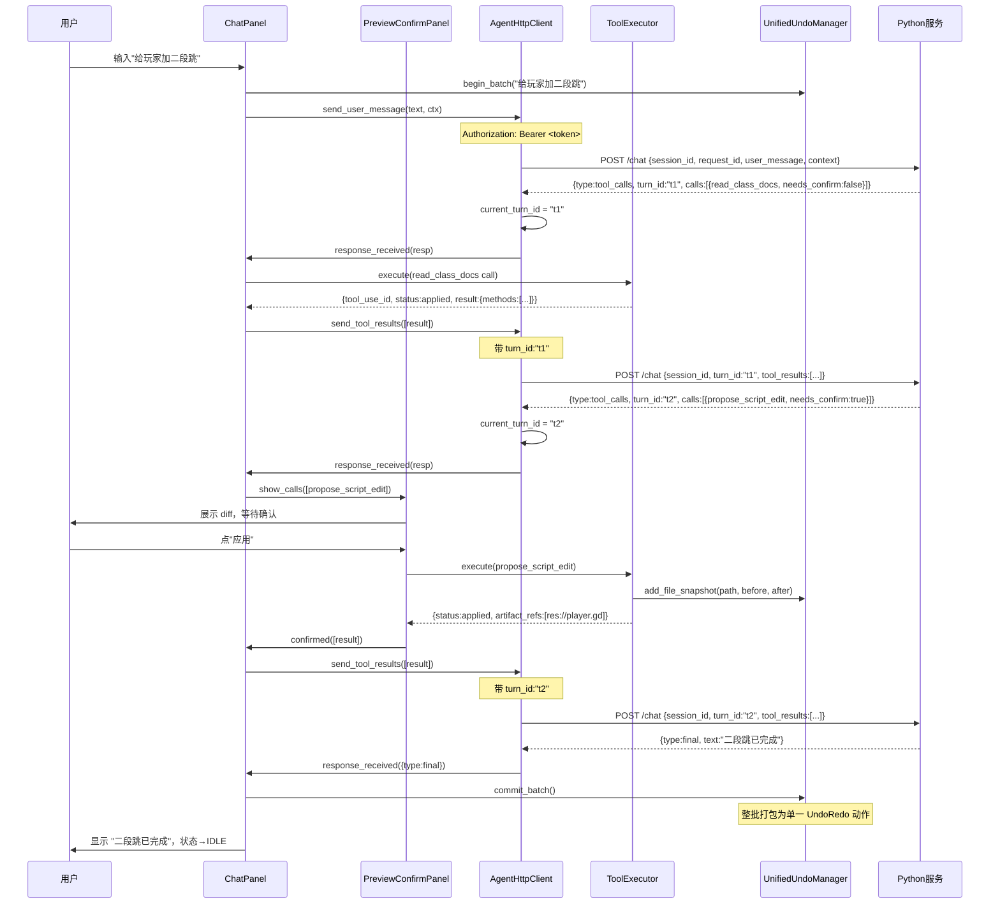

# GDScript 前端架构方案（Godot 编辑器插件）

| 项目 | 内容 |
|------|------|
| 文档名称 | AI 游戏开发 Agent —— GDScript 前端架构方案 |
| 版本 | v0.1 |
| 日期 | 2026-06-05 |
| 依据 | 《Godot 内嵌 AI 游戏开发 Agent 需求文档》v0.8；《Python LLM 服务架构方案》v0.4；《多智能体与权限系统详细设计》v0.2 |
| 范围 | **Godot 编辑器插件（前端层）**；Python 服务内部实现不在本文，但定义双方通信协议的前端侧 |

> **定位**：本文描述三层架构中的**前端层**——运行在 Godot 编辑器进程内、以 GDScript `@tool` 编写的 EditorPlugin。它负责：管理 Python 服务子进程、驱动 Agent 循环、收集 ClassDB 签名、渲染预览确认、落地改动并登记统一撤销入口。

---

## 1. 职责边界（与 Python 服务的分工）

| 职责 | 前端（本文） | Python 服务 |
|------|------|------|
| 聊天 UI、状态展示 | ✅ | — |
| 收集上下文（选中节点、场景树、tile_catalog） | ✅ | — |
| **ClassDB 真实签名**（方法/属性/信号，含自定义类/GDExtension） | ✅ | — |
| HTTP 请求 + **token 鉴权** | ✅（发出方） | ✅（验证方） |
| 前端工具执行（脚本写入、节点操作、地图绘制、资源创建） | ✅ | — |
| **预览确认面板**（diff / 操作清单 + needs_confirm） | ✅ | — |
| **统一撤销入口**（UndoRedo + 文件快照回滚） | ✅ | — |
| **turn_id 追踪**与幂等回传 | ✅ | ✅（校验方） |
| 拉起 / 关闭 Python 子进程 | ✅（生命周期管理） | — |
| LLM 调用、多智能体编排、RAG 检索 | — | ✅ |
| 官方文档 prose 增强 | — | ✅ |

---

## 2. 目录结构

```
addons/ai_agent/
├── plugin.cfg
├── plugin.gd                        # EditorPlugin 入口，注册/清理一切
│
├── service/
│   ├── service_manager.gd           # Python 子进程生命周期 + token + 端口
│   └── agent_http_client.gd        # HTTPRequest 封装，token 鉴权，turn_id
│
├── context/
│   ├── context_collector.gd         # 收集结构化上下文（编辑器状态快照）
│   └── classdb_reader.gd            # ClassDB 签名读取 + 格式化
│
├── ui/
│   ├── chat_panel.gd                # 聊天面板（停靠面板 UI 根节点）
│   ├── chat_panel.tscn
│   ├── preview_confirm_panel.gd     # 预览确认面板（diff / 操作清单）
│   └── preview_confirm_panel.tscn
│
├── tools/                           # 前端工具执行（按域分文件）
│   ├── tool_executor.gd             # 工具调用路由总入口
│   ├── program_tools.gd             # 脚本读写（read_script, propose_script_edit）
│   ├── map_tools.gd                 # TileMapLayer 操作（fill_rect, draw_line…）
│   ├── scene_tools.gd               # 节点操作（read_scene_tree, add_node…）
│   └── resource_tools.gd            # 资源/项目（create_resource, batch_rename…）
│
├── undo/
│   └── unified_undo_manager.gd      # 统一撤销入口（UndoRedo + 文件快照）
│
└── dto/
    └── agent_dto.gd                 # 前端侧 DTO（Context, ToolCall, ToolResult…）
```

---

## 3. 模块详解

### 3.1 插件入口（`plugin.gd`）

```gdscript
@tool
extends EditorPlugin

const ServiceManager = preload("res://addons/ai_agent/service/service_manager.gd")
const ChatPanel      = preload("res://addons/ai_agent/ui/chat_panel.tscn")

var _service: ServiceManager
var _chat_panel: Control
var _undo_manager  # UnifiedUndoManager

func _enter_tree() -> void:
    _service = ServiceManager.new()
    add_child(_service)

    _undo_manager = preload("res://addons/ai_agent/undo/unified_undo_manager.gd").new()
    _undo_manager.undo_redo = get_undo_redo()   # EditorUndoRedoManager（Godot 4.x）
    add_child(_undo_manager)

    _chat_panel = ChatPanel.instantiate()
    _chat_panel.service      = _service
    _chat_panel.undo_manager = _undo_manager
    add_control_to_dock(DOCK_SLOT_RIGHT_BL, _chat_panel)

    _service.start()   # 生成 token → 拉起 Python 子进程

func _exit_tree() -> void:
    remove_control_from_docks(_chat_panel)
    _chat_panel.queue_free()
    _service.stop()
```

**要点**：
- `get_undo_redo()` 返回 Godot 4.x 的 `EditorUndoRedoManager`，支持跨场景的编辑器级撤销。
- `ServiceManager` 是 `Node`，挂在插件下，跟随编辑器生命周期。

---

### 3.2 服务生命周期管理（`service_manager.gd`）

负责：生成 **一次性 token**、选端口、拉起 Python 子进程、健康检测、关闭。

```gdscript
@tool
extends Node

signal service_ready
signal service_stopped

## 当前 token（只存内存，不落盘）
var token: String = ""
## 绑定端口（随机或配置值）
var port: int = 0
## Python 子进程 PID
var _pid: int = -1
## 健康检测定时器
var _health_timer: Timer
## 最大重试次数
const MAX_HEALTH_RETRIES = 10

# ---- 对外 API ----

func start() -> void:
    token = _generate_token()
    port  = _pick_port()
    var python = ProjectSettings.get_setting(
        "ai_agent/python_executable", "python")
    var script = ProjectSettings.get_setting(
        "ai_agent/service_script", "res://server/app/main.py")
    _pid = OS.create_process(python, [
        ProjectSettings.globalize_path(script),
        "--token", token,
        "--port",  str(port),
    ])
    _start_health_polling()

func stop() -> void:
    _health_timer.stop()
    if _pid > 0:
        OS.kill(_pid)
        _pid = -1
    service_stopped.emit()

func is_running() -> bool:
    return _pid > 0

# ---- 内部实现 ----

## 生成 32 字节密码学安全随机 token（hex 编码，64 字符）
func _generate_token() -> String:
    var crypto = Crypto.new()
    var bytes  = crypto.generate_random_bytes(32)
    return bytes.hex_encode()

## 选端口：ProjectSettings 中配置优先，否则在 49152–65535 随机选
func _pick_port() -> int:
    var cfg = ProjectSettings.get_setting("ai_agent/service_port", 0)
    if cfg > 0:
        return cfg
    return 49152 + (randi() % 16383)

func _start_health_polling() -> void:
    _health_timer = Timer.new()
    _health_timer.wait_time = 1.0
    _health_timer.timeout.connect(_poll_health)
    add_child(_health_timer)
    _health_timer.start()
    _health_retries = 0

var _health_retries: int = 0

func _poll_health() -> void:
    # 简单 GET /health，复用 AgentHttpClient 的实现
    _health_retries += 1
    if _health_retries > MAX_HEALTH_RETRIES:
        push_warning("[ai_agent] Python service 未能在超时内就绪")
        _health_timer.stop()
        return
    # 实际健康检测在 AgentHttpClient._check_health() 中发起，这里仅作计数守卫
```

**安全要点**（对应 Python 服务 §9.0）：

| 措施 | GDScript 侧 |
|------|------|
| **一次性 token** | `Crypto.generate_random_bytes(32).hex_encode()`，仅存 `_service.token`（内存），不写磁盘、不进版本库 |
| **随机端口** | `49152 + randi() % 16383`，避免固定端口被探测/抢占 |
| **token 随生命周期轮换** | `stop()` 后 token 清空；下次 `start()` 重新生成 |
| **传递方式** | 通过命令行 `--token` 传给子进程（不经网络，进程间直传） |

---

### 3.3 HTTP 客户端（`agent_http_client.gd`）

单一职责：封装所有对 Python 服务的 HTTP 通信，含 **token 鉴权**、**turn_id 追踪**、**per-session 串行队列**。

```gdscript
@tool
extends Node

signal response_received(response: Dictionary)
signal error_occurred(message: String)

var _service: Node   # ServiceManager 引用（取 token/port）
var _http: HTTPRequest

## 当前会话 ID（UUID）
var session_id: String = ""
## 本轮挂起的 turn_id（用于 tool_results 回传校验）
var current_turn_id: String = ""
## 是否有请求正在进行（串行保证）
var _busy: bool = false

func _ready() -> void:
    _http = HTTPRequest.new()
    add_child(_http)
    _http.request_completed.connect(_on_request_completed)
    session_id = _new_uuid()

# ---- 对外 API ----

## 发送用户消息（Agent 循环第一步）
func send_user_message(user_message: String, context: Dictionary) -> void:
    _send({
        "session_id":    session_id,
        "request_id":    _new_uuid(),   # 幂等键
        "user_message":  user_message,
        "context":       context,
        "permission_mode": "default",
    })

## 回传前端工具执行结果（Agent 循环 N+1 步）
## tool_results: Array[Dictionary]，每项含 tool_use_id / frame_id / status / result
func send_tool_results(tool_results: Array) -> void:
    assert(current_turn_id != "", "must have a current_turn_id before sending tool_results")
    _send({
        "session_id":   session_id,
        "turn_id":      current_turn_id,   # 告知服务本批次
        "tool_results": tool_results,
    })

## 重置会话
func reset_session() -> void:
    session_id = _new_uuid()
    current_turn_id = ""
    _http.request(_url("/reset"), _headers(), HTTPClient.METHOD_POST, "")

## 健康检查
func check_health(callback: Callable) -> void:
    # 简单包装，结果直接 callback
    var temp = HTTPRequest.new()
    add_child(temp)
    temp.request_completed.connect(func(result, code, _h, body):
        callback.call(code == 200)
        temp.queue_free()
    )
    temp.request(_url("/health"), _headers())

# ---- 内部 ----

func _send(payload: Dictionary) -> void:
    if _busy:
        push_warning("[ai_agent] HTTP client busy, dropping request")
        return
    _busy = true
    var body = JSON.stringify(payload)
    var err  = _http.request(_url("/chat"), _headers(), HTTPClient.METHOD_POST, body)
    if err != OK:
        _busy = false
        error_occurred.emit("HTTPRequest 启动失败: " + str(err))

func _on_request_completed(result: int, code: int, _headers: PackedStringArray, body: PackedByteArray) -> void:
    _busy = false
    if result != HTTPRequest.RESULT_SUCCESS or code != 200:
        error_occurred.emit("HTTP %d / result %d" % [code, result])
        return
    var json = JSON.new()
    if json.parse(body.get_string_from_utf8()) != OK:
        error_occurred.emit("JSON 解析失败")
        return
    var resp: Dictionary = json.get_data()
    # 更新 turn_id（tool_calls 响应才有）
    if resp.get("type") == "tool_calls" and resp.has("turn_id"):
        current_turn_id = resp["turn_id"]
    response_received.emit(resp)

## 构造鉴权 header（每次取最新 token）
func _headers() -> PackedStringArray:
    return PackedStringArray([
        "Content-Type: application/json",
        "Authorization: Bearer " + _service.token,
    ])

func _url(path: String) -> String:
    return "http://127.0.0.1:%d%s" % [_service.port, path]

func _new_uuid() -> String:
    return "%x-%x-%x-%x-%x" % [
        randi(), randi() & 0xffff, randi() & 0xffff,
        randi() & 0xffff, randi(),
    ]
```

**turn_id 追踪规则**（对应 Python 服务 §14.1）：

```
服务返回 tool_calls 响应
    └── resp["turn_id"] → 存入 current_turn_id

前端执行 / 确认完毕后调用 send_tool_results(results)
    └── payload 带 "turn_id": current_turn_id
    └── 服务端用 turn_id 定位挂起帧、校验 pending_tool_call_ids

收到 final / error 响应
    └── current_turn_id 清空（下一轮用户消息不带 turn_id）
```

---

### 3.4 上下文收集器（`context_collector.gd`）

按需收集结构化上下文，**只收与当前任务相关的片段**（不全量塞入工程），对应 PRD FR-20/FR-22。

```gdscript
@tool
extends Node

## 收集结构化 Context Dict（交给 AgentHttpClient.send_user_message）
## domain_hint: "program" | "map" | "scene" | "resource" | "any"
func collect(domain_hint: String = "any") -> Dictionary:
    var ctx: Dictionary = {}

    # 1. 选中对象（节点 / 脚本）
    ctx["selection"] = _collect_selection()

    # 2. 场景树（场景/节点域始终需要；编程域按需）
    if domain_hint in ["scene", "any"]:
        ctx["scene_tree"] = _collect_scene_tree()

    # 3. 瓦片目录（仅地图域）
    if domain_hint in ["map", "any"]:
        ctx["tile_catalog"] = _collect_tile_catalog()

    # 4. 工程相关文件清单（编程域）
    if domain_hint in ["program", "any"]:
        ctx["project_files"] = _collect_project_files()

    # 5. 调试器错误（M2）
    ctx["debugger_errors"] = _collect_debugger_errors()

    return ctx

# ---- 选中对象 ----
func _collect_selection() -> Dictionary:
    var sel = EditorInterface.get_selection()
    var nodes = sel.get_selected_nodes()
    if nodes.is_empty():
        return {}
    var node: Node = nodes[0]
    var result = {
        "node_path":  str(node.get_path()),
        "node_class": node.get_class(),
        "node_name":  node.name,
        "properties": _collect_node_props(node),
    }
    # 如果节点挂了脚本，一并读脚本内容
    if node.get_script():
        var script = node.get_script() as Script
        result["script_path"]    = script.resource_path
        result["script_content"] = script.source_code
        result["script_language"] = (
            "csharp" if script.resource_path.ends_with(".cs") else "gdscript"
        )
    return result

func _collect_node_props(node: Node) -> Dictionary:
    var props = {}
    for prop in node.get_property_list():
        if prop["usage"] & PROPERTY_USAGE_EDITOR:
            var val = node.get(prop["name"])
            if val != null:
                props[prop["name"]] = var_to_str(val)
    return props

# ---- 场景树（递归，深度限 5 防止超大场景塞满上下文）----
func _collect_scene_tree(max_depth: int = 5) -> Dictionary:
    var root = EditorInterface.get_edited_scene_root()
    if not root:
        return {}
    return _node_to_dict(root, 0, max_depth)

func _node_to_dict(node: Node, depth: int, max_depth: int) -> Dictionary:
    var d = {
        "name":  node.name,
        "class": node.get_class(),
        "path":  str(node.get_path()),
    }
    if node.get_script():
        d["script"] = (node.get_script() as Script).resource_path
    if depth < max_depth:
        var children = []
        for child in node.get_children():
            children.append(_node_to_dict(child, depth + 1, max_depth))
        if not children.is_empty():
            d["children"] = children
    return d

# ---- 瓦片目录（来自选中的 TileMapLayer）----
func _collect_tile_catalog() -> Array:
    var nodes = EditorInterface.get_selection().get_selected_nodes()
    for node in nodes:
        if node is TileMapLayer:
            return _extract_tile_catalog(node)
    return []

func _extract_tile_catalog(tilemap: TileMapLayer) -> Array:
    var catalog = []
    var tileset = tilemap.tile_set
    if not tileset:
        return catalog
    for src_id in tileset.get_source_count():
        var real_id = tileset.get_source_id(src_id)
        var source  = tileset.get_source(real_id)
        if source is TileSetAtlasSource:
            for i in source.get_tiles_count():
                var coords = source.get_tile_id(i)
                catalog.append({
                    "source_id":   real_id,
                    "atlas_coords": [coords.x, coords.y],
                    "name":        "%d/(%d,%d)" % [real_id, coords.x, coords.y],
                })
    return catalog

# ---- 工程文件清单（只给 GDScript / C# / tscn / tres，限 200 条）----
func _collect_project_files() -> Array:
    var files = []
    var dir = DirAccess.open("res://")
    _scan_dir(dir, "res://", files, 0)
    return files.slice(0, 200)

func _scan_dir(dir: DirAccess, base: String, out: Array, depth: int) -> void:
    if depth > 4 or not dir:
        return
    dir.list_dir_begin()
    var name = dir.get_next()
    while name != "":
        if name.begins_with(".") or name == "addons":
            name = dir.get_next()
            continue
        var full = base + name
        if dir.current_is_dir():
            var sub = DirAccess.open(full)
            _scan_dir(sub, full + "/", out, depth + 1)
        elif name.ends_with(".gd") or name.ends_with(".cs") \
          or name.ends_with(".tscn") or name.ends_with(".tres"):
            out.append(full)
        name = dir.get_next()
    dir.list_dir_end()

# ---- 调试器错误（M2：读 EditorDebuggerPlugin 输出，占位）----
func _collect_debugger_errors() -> Array:
    # M1 返回空；M2 接 EditorDebuggerPlugin.capture() 实现
    return []
```

---

### 3.5 ClassDB 签名读取（`classdb_reader.gd`）

**ClassDB 签名完全在前端读取**，100% 对应用户引擎版本，含自定义类、GDExtension、插件类。服务端只负责合并官方 prose（见 Python 服务 §12）。

```gdscript
@tool
extends RefCounted

## 读取一个类的完整签名（方法 / 属性 / 信号 / 常量 / 继承链）
## 返回结构化 Dictionary，直接作为 tool_results 的 result 字段
static func get_class_info(class_name: String) -> Dictionary:
    if not ClassDB.class_exists(class_name):
        # 尝试自定义脚本类（ResourceLoader 路径）
        return _try_script_class(class_name)

    return {
        "name":       class_name,
        "parent":     ClassDB.get_parent_class(class_name),
        "methods":    _get_methods(class_name),
        "properties": _get_properties(class_name),
        "signals":    _get_signals(class_name),
        "constants":  _get_constants(class_name),
        "source":     "ClassDB",   # 供服务端 enrich 判断是否补 prose
    }

## 批量查（coordinator 传来多个类名时用）
static func get_multi(class_names: Array) -> Array:
    var result = []
    for cn in class_names:
        result.append(get_class_info(cn))
    return result

# ---- 方法列表（仅本类定义，no_inheritance=true）----
static func _get_methods(cn: String) -> Array:
    var out = []
    for m in ClassDB.class_get_method_list(cn, true):
        if m["name"].begins_with("_") and not m["name"] in ["_ready","_process","_physics_process","_input","_unhandled_input"]:
            continue   # 跳过内部 virtual（按需可开放）
        var entry = {
            "name":   m["name"],
            "return": _type_str(m["return"]),
            "args":   [],
        }
        for arg in m["args"]:
            entry["args"].append({
                "name":    arg["name"],
                "type":    _type_str(arg),
                "default": arg.get("default_value", ""),
            })
        out.append(entry)
    return out

# ---- 属性列表 ----
static func _get_properties(cn: String) -> Array:
    var out = []
    for p in ClassDB.class_get_property_list(cn, true):
        var usage = p.get("usage", 0)
        # 过滤分类标题、内部标记
        if usage & PROPERTY_USAGE_CATEGORY or usage & PROPERTY_USAGE_INTERNAL:
            continue
        out.append({
            "name":     p["name"],
            "type":     _type_str(p),
            "exported": bool(usage & PROPERTY_USAGE_EDITOR),
        })
    return out

# ---- 信号列表 ----
static func _get_signals(cn: String) -> Array:
    var out = []
    for s in ClassDB.class_get_signal_list(cn, true):
        var entry = {"name": s["name"], "args": []}
        for arg in s.get("args", []):
            entry["args"].append({"name": arg["name"], "type": _type_str(arg)})
        out.append(entry)
    return out

# ---- 常量（枚举值）----
static func _get_constants(cn: String) -> Dictionary:
    var out = {}
    for c in ClassDB.class_get_integer_constant_list(cn, true):
        out[c] = ClassDB.class_get_integer_constant(cn, c)
    return out

# ---- 将 Godot 类型描述 dict 转为可读字符串 ----
static func _type_str(info: Dictionary) -> String:
    var t: int = info.get("type", TYPE_NIL)
    if t == TYPE_OBJECT:
        return info.get("class_name", "Object")
    return type_string(t)

# ---- 自定义脚本类兜底（EditorInterface 的脚本类注册表）----
static func _try_script_class(class_name: String) -> Dictionary:
    var classes = ProjectSettings.get_global_class_list()
    for cls in classes:
        if cls["class"] == class_name:
            var script = load(cls["path"]) as Script
            if script:
                return {
                    "name":   class_name,
                    "parent": cls.get("base", ""),
                    "path":   cls["path"],
                    "source": "script_class",   # 服务端不补 prose（无官方文档）
                }
    return {"name": class_name, "source": "unknown"}
```

**分工细节**（对应 Python 服务 §12）：

```
前端（本文）                    服务端（python服务架构方案 §12）
─────────────────────────       ─────────────────────────────
ClassDB.class_get_*()           DOC_DUMP.lookup(class_name)
└─ 真实签名（方法/属性/信号）    └─ 官方 prose 描述（参数含义/注意事项）
└─ 自定义类 / GDExtension       └─ 仅标准引擎类有 prose，自定义类跳过
└─ 当前引擎版本实时精确          └─ 按 engine_version 选版本 doc dump
```

---

### 3.6 聊天面板 UI（`chat_panel.gd`）

```gdscript
@tool
extends Control

## 依赖注入（由 plugin.gd 设置）
var service         # ServiceManager
var undo_manager    # UnifiedUndoManager

var _http_client: Node   # AgentHttpClient
var _collector: Node     # ContextCollector
var _tool_executor: Node # ToolExecutor
var _preview_panel: Node # PreviewConfirmPanel

## Agent 循环状态机
enum State { IDLE, WAITING_LLM, WAITING_CONFIRM, EXECUTING }
var _state: State = State.IDLE

@onready var _message_list: RichTextLabel = $VBox/MessageList
@onready var _input_field: LineEdit       = $VBox/Bottom/InputField
@onready var _send_btn: Button            = $VBox/Bottom/SendBtn
@onready var _status_label: Label         = $VBox/StatusBar/StatusLabel
@onready var _reset_btn: Button           = $VBox/StatusBar/ResetBtn

func _ready() -> void:
    _http_client   = preload("res://addons/ai_agent/service/agent_http_client.gd").new()
    _http_client.name = "AgentHttpClient"
    _http_client._service = service
    add_child(_http_client)

    _collector     = preload("res://addons/ai_agent/context/context_collector.gd").new()
    add_child(_collector)

    _tool_executor = preload("res://addons/ai_agent/tools/tool_executor.gd").new()
    _tool_executor.undo_manager = undo_manager
    _tool_executor.classdb_reader = preload("res://addons/ai_agent/context/classdb_reader.gd")
    add_child(_tool_executor)

    _http_client.response_received.connect(_on_response)
    _http_client.error_occurred.connect(_on_error)
    _send_btn.pressed.connect(_on_send)
    _reset_btn.pressed.connect(_on_reset)

# ── 用户点"发送" ──────────────────────────────────────────────
func _on_send() -> void:
    var text = _input_field.text.strip_edges()
    if text.is_empty() or _state != State.IDLE:
        return
    _input_field.clear()
    _append_message("user", text)

    # 收集上下文（根据消息内容粗略判断域，可后续改为模型路由）
    var ctx = _collector.collect("any")

    _set_state(State.WAITING_LLM)
    undo_manager.begin_batch("AI: " + text.left(40))   # 预先开启一轮 batch
    _http_client.send_user_message(text, ctx)

# ── 收到服务响应 ──────────────────────────────────────────────
func _on_response(resp: Dictionary) -> void:
    match resp.get("type", ""):
        "tool_calls":
            _handle_tool_calls(resp)
        "final":
            _handle_final(resp)
        "error":
            _on_error(resp.get("text", "未知错误"))

func _handle_tool_calls(resp: Dictionary) -> void:
    var calls: Array = resp.get("calls", [])
    if calls.is_empty():
        return

    # 分流：需要确认的 vs 可以直接执行的
    var confirm_calls = calls.filter(func(c): return c.get("needs_confirm", false))
    var silent_calls  = calls.filter(func(c): return not c.get("needs_confirm", false))

    # 静默工具（只读）先执行，收集结果
    var results: Array = []
    for call in silent_calls:
        var res = _tool_executor.execute(call)
        results.append(res)

    # 若有需要确认的，挂起等用户操作
    if not confirm_calls.is_empty():
        _set_state(State.WAITING_CONFIRM)
        _preview_panel.show_calls(confirm_calls)
        # 信号 confirmed / rejected 由 preview_panel 触发，见 §3.7
        _preview_panel.confirmed.connect(
            func(confirm_results): _on_confirmed(results + confirm_results), CONNECT_ONE_SHOT)
        _preview_panel.rejected.connect(
            func(reject_results): _on_confirmed(results + reject_results), CONNECT_ONE_SHOT)
    else:
        # 全部静默完成，立即回传
        _set_state(State.WAITING_LLM)
        _http_client.send_tool_results(results)

func _on_confirmed(all_results: Array) -> void:
    _set_state(State.WAITING_LLM)
    _http_client.send_tool_results(all_results)

func _handle_final(resp: Dictionary) -> void:
    _append_message("assistant", resp.get("text", ""))
    undo_manager.commit_batch()   # 提交整批撤销动作
    _set_state(State.IDLE)
    _http_client.current_turn_id = ""   # 清空 turn_id

func _on_error(msg: String) -> void:
    _append_message("error", "⚠ " + msg)
    undo_manager.abort_batch()    # 异常时放弃这轮 batch
    _set_state(State.IDLE)

func _on_reset() -> void:
    _http_client.reset_session()
    _message_list.clear()
    undo_manager.abort_batch()
    _set_state(State.IDLE)

# ── 工具方法 ─────────────────────────────────────────────────
func _set_state(s: State) -> void:
    _state = s
    _send_btn.disabled = (s != State.IDLE)
    match s:
        State.IDLE:           _status_label.text = "就绪"
        State.WAITING_LLM:    _status_label.text = "思考中…"
        State.WAITING_CONFIRM:_status_label.text = "等待确认"
        State.EXECUTING:      _status_label.text = "执行中…"

func _append_message(role: String, text: String) -> void:
    var color = {"user":"#aee8ff","assistant":"#e8ffe8","error":"#ffaaaa"}.get(role,"white")
    _message_list.append_text("[color=%s][b]%s[/b][/color]\n%s\n\n" % [color, role, text])
```

---

### 3.7 预览确认面板（`preview_confirm_panel.gd`）

渲染 **diff（代码改动）** 或 **操作清单（场景/地图/资源改动）**，收集用户的 apply / reject 决策。

```gdscript
@tool
extends PanelContainer

signal confirmed(results: Array)   # 用户确认后，携带已落地工具结果
signal rejected(results: Array)    # 用户拒绝后，携带 rejected 状态结果

@onready var _title:    Label         = $VBox/Header/Title
@onready var _content:  RichTextLabel = $VBox/Content
@onready var _apply_btn:Button        = $VBox/Footer/ApplyBtn
@onready var _reject_btn:Button       = $VBox/Footer/RejectBtn

var _pending_calls: Array = []
var _tool_executor: Node  # 注入，用于落地

func _ready() -> void:
    _apply_btn.pressed.connect(_on_apply)
    _reject_btn.pressed.connect(_on_reject)
    hide()

## 主入口：展示一批需要确认的工具调用
func show_calls(calls: Array) -> void:
    _pending_calls = calls
    _content.clear()
    for call in calls:
        _render_call(call)
    _title.text = "预览 %d 项改动" % calls.size()
    show()

func _render_call(call: Dictionary) -> void:
    var name: String = call.get("name", "")
    var input: Dictionary = call.get("input", {})
    _content.append_text("[b]▶ %s[/b]（%s）\n" % [name, call.get("agent", "")])

    match name:
        "propose_script_edit":
            _render_script_diff(input)
        "add_node", "set_node_property", "instance_scene":
            _render_op_list(input)
        "fill_rect","draw_rect_border","draw_line","set_cells","clear_rect":
            _render_map_op(input)
        "create_resource","batch_rename","set_project_setting":
            _render_op_list(input)
        _:
            _content.append_text("[code]%s[/code]\n" % JSON.stringify(input, "  "))
    _content.append_text("\n")

## 代码改动：渲染 unified diff（红 = 删除，绿 = 新增）
func _render_script_diff(input: Dictionary) -> void:
    var diff_lines: Array = input.get("diff", [])
    if diff_lines.is_empty() and input.has("after"):
        # 服务给全量 after 时，前端自行 diff
        diff_lines = _simple_diff(
            input.get("before", ""),
            input.get("after",  ""))
    for line in diff_lines:
        if line.begins_with("+"):
            _content.append_text("[color=#88ff88]%s[/color]\n" % line)
        elif line.begins_with("-"):
            _content.append_text("[color=#ff8888]%s[/color]\n" % line)
        else:
            _content.append_text("%s\n" % line)

## 节点/资源/地图操作：渲染结构化清单
func _render_op_list(input: Dictionary) -> void:
    _content.append_text(JSON.stringify(input, "  ") + "\n")

func _render_map_op(input: Dictionary) -> void:
    var rect = input.get("rect", input.get("from",""))
    _content.append_text("区域：%s  瓦片：%s\n" % [str(rect), str(input.get("tile",""))])

# ── 用户点"应用" ──────────────────────────────────────────────
func _on_apply() -> void:
    hide()
    var results: Array = []
    for call in _pending_calls:
        var res = _tool_executor.execute(call)   # 落地改动（写文件/操作节点）
        results.append(res)
    confirmed.emit(results)

# ── 用户点"拒绝" ──────────────────────────────────────────────
func _on_reject() -> void:
    hide()
    var results: Array = []
    for call in _pending_calls:
        results.append({
            "tool_use_id": call["id"],
            "frame_id":    call.get("frame_id",""),
            "turn_id":     "",          # 由 send_tool_results 填充
            "status":      "rejected",
            "result":      null,
        })
    rejected.emit(results)

## 极简 unified diff（行级）
static func _simple_diff(before: String, after: String) -> Array:
    var a_lines = before.split("\n")
    var b_lines = after.split("\n")
    var out = []
    # 简化实现：按行对比，不做 LCS（M1 够用；M2 可替换为完整 Myers diff）
    var max_l = max(a_lines.size(), b_lines.size())
    for i in max_l:
        var a = a_lines[i] if i < a_lines.size() else ""
        var b = b_lines[i] if i < b_lines.size() else ""
        if a == b:
            out.append("  " + a)
        else:
            if a != "": out.append("- " + a)
            if b != "": out.append("+ " + b)
    return out
```

> **M1**：整批 Apply / Reject。**M2**：在每个 `_render_call` 旁加复选框，支持逐条勾选后部分应用（对应 PRD D5）。

---

### 3.8 工具执行器（`tool_executor.gd`）

路由总入口，按工具名分发到各域实现，并将执行结果格式化为 `ToolResult` Dict。

```gdscript
@tool
extends Node

var undo_manager     # UnifiedUndoManager（注入）
var classdb_reader   # ClassdbReader class（注入）

## 执行单个前端工具调用，返回 ToolResult Dict
func execute(call: Dictionary) -> Dictionary:
    var name:     String     = call.get("name",     "")
    var input:    Dictionary = call.get("input",    {})
    var call_id:  String     = call.get("id",       "")
    var frame_id: String     = call.get("frame_id", "")

    var result = _dispatch(name, input)
    return {
        "tool_use_id": call_id,
        "frame_id":    frame_id,
        "turn_id":     "",          # 由 send_tool_results 统一填入 current_turn_id
        "status":      "applied" if result.get("ok", false) else "error",
        "result":      result,
        "error_code":  result.get("error_code", null),
        "artifact_refs": result.get("artifact_refs", []),
    }

func _dispatch(name: String, input: Dictionary) -> Dictionary:
    match name:
        # ── 编程域 ─────────────────────────────────────
        "read_script":
            return ProgramTools.read_script(input)
        "propose_script_edit":
            return ProgramTools.apply_script_edit(input, undo_manager)
        "list_project_files":
            return ProgramTools.list_project_files(input)
        "read_debugger_errors":
            return ProgramTools.read_debugger_errors()
        "propose_tests":
            return ProgramTools.apply_script_edit(input, undo_manager)   # 同写脚本
        # ── ClassDB 接地（只读，前端执行 + 服务端 enrich）──
        "read_class_docs":
            return classdb_reader.get_class_info(input.get("class_name",""))
        # ── 地图域 ─────────────────────────────────────
        "fill_rect":
            return MapTools.fill_rect(input, undo_manager)
        "draw_rect_border":
            return MapTools.draw_rect_border(input, undo_manager)
        "draw_line":
            return MapTools.draw_line(input, undo_manager)
        "set_cells":
            return MapTools.set_cells(input, undo_manager)
        "clear_rect":
            return MapTools.clear_rect(input, undo_manager)
        # ── 场景域 ─────────────────────────────────────
        "read_scene_tree":
            return SceneTools.read_scene_tree()
        "add_node":
            return SceneTools.add_node(input, undo_manager)
        "set_node_property":
            return SceneTools.set_node_property(input, undo_manager)
        "instance_scene":
            return SceneTools.instance_scene(input, undo_manager)
        # ── 资源/项目域 ────────────────────────────────
        "create_resource":
            return ResourceTools.create_resource(input, undo_manager)
        "batch_rename":
            return ResourceTools.batch_rename(input, undo_manager)
        "read_project_settings":
            return ResourceTools.read_project_settings(input)
        "set_project_setting":
            return ResourceTools.set_project_setting(input, undo_manager)
        _:
            return {"ok": false, "error_code": "UNKNOWN_TOOL",
                    "message": "前端未知工具: " + name}

# 静态引用各域
const ProgramTools  = preload("res://addons/ai_agent/tools/program_tools.gd")
const MapTools      = preload("res://addons/ai_agent/tools/map_tools.gd")
const SceneTools    = preload("res://addons/ai_agent/tools/scene_tools.gd")
const ResourceTools = preload("res://addons/ai_agent/tools/resource_tools.gd")
```

#### 编程工具示例（`program_tools.gd`）

```gdscript
@tool
extends RefCounted

static func read_script(input: Dictionary) -> Dictionary:
    var path: String = input.get("path", "")
    if path.is_empty():
        # 取当前编辑器打开的脚本
        var script = EditorInterface.get_script_editor() \
                        .get_current_script()
        if not script:
            return {"ok": false, "error_code": "NO_SCRIPT"}
        path = script.resource_path
    var content = FileAccess.get_file_as_string(path)
    return {"ok": true, "path": path, "content": content}

static func apply_script_edit(input: Dictionary, undo_mgr) -> Dictionary:
    var path:    String = input.get("path", "")
    var content: String = input.get("after", input.get("content", ""))
    if path.is_empty() or content.is_empty():
        return {"ok": false, "error_code": "MISSING_PARAMS"}

    # 保存 before 快照（供撤销）
    var before = FileAccess.get_file_as_string(path)
    undo_mgr.add_file_snapshot(path, before, content)

    # 写入文件
    var f = FileAccess.open(path, FileAccess.WRITE)
    if not f:
        return {"ok": false, "error_code": "WRITE_FAILED"}
    f.store_string(content)
    f.close()

    # 通知编辑器重新加载资源
    EditorInterface.get_resource_filesystem().update_file(path)
    EditorInterface.get_script_editor().reload_scripts()

    return {"ok": true, "path": path, "artifact_refs": [path]}
```

---

### 3.9 统一撤销入口（`unified_undo_manager.gd`）

将一轮 Agent 交互中**所有改动**（节点操作 + 文件写入）打包为**一个可撤销动作**，对应 PRD NFR-3/FR-6。

```gdscript
@tool
extends Node

## 由 plugin.gd 注入（EditorUndoRedoManager）
var undo_redo: EditorUndoRedoManager

## 文件快照列表（当前 batch 内）
var _file_snapshots: Array = []   # Array[{path, before, after}]
## 当前 batch 描述
var _batch_desc: String = ""
## batch 是否已开启
var _batch_open: bool = false

# ──────────────────────────────────────────────────
# 对外 API（由 ChatPanel / ToolExecutor 调用）
# ──────────────────────────────────────────────────

## 开启一轮 batch（一次用户请求对应一个 batch）
func begin_batch(description: String) -> void:
    if _batch_open:
        push_warning("[undo] begin_batch called while already open, aborting previous")
        abort_batch()
    _batch_desc  = description
    _file_snapshots.clear()
    _batch_open  = true
    undo_redo.create_action(_batch_desc, UndoRedo.MERGE_DISABLE,
                            EditorInterface.get_edited_scene_root())

## 登记节点改动（使用 UndoRedo 原生 do/undo method）
## 调用方（SceneTools 等）直接调用此方法代替直接操作 undo_redo
func add_node_action(
        do_object: Object, do_method: StringName, do_args: Array,
        undo_object: Object, undo_method: StringName, undo_args: Array) -> void:
    assert(_batch_open, "add_node_action called outside batch")
    undo_redo.add_do_method(do_object, do_method, do_args)
    undo_redo.add_undo_method(undo_object, undo_method, undo_args)

## 登记属性改动
func add_property_action(node: Node, prop: StringName, new_val, old_val) -> void:
    assert(_batch_open, "add_property_action called outside batch")
    undo_redo.add_do_property(node, prop, new_val)
    undo_redo.add_undo_property(node, prop, old_val)

## 登记文件快照（由 ProgramTools / ResourceTools 在 apply_script_edit 前后调用）
## before 在写入前取，after 在写入后取（或直接传 new_content）
func add_file_snapshot(path: String, before: String, after: String) -> void:
    assert(_batch_open, "add_file_snapshot called outside batch")
    _file_snapshots.append({"path": path, "before": before, "after": after})
    # 把文件还原注册为 UndoRedo 的 do/undo 方法
    undo_redo.add_do_method(self, &"_write_file", path, after)
    undo_redo.add_undo_method(self, &"_write_file", path, before)

## 提交 batch：commit_action 使整批成为单一可撤销条目
func commit_batch() -> void:
    if not _batch_open:
        return
    undo_redo.commit_action()
    _batch_open = false
    _file_snapshots.clear()

## 中止 batch（异常 / 错误时不提交）
func abort_batch() -> void:
    if not _batch_open:
        return
    # Godot 4 EditorUndoRedoManager 暂无 discard_action()，
    # 以 create_action + 立即 commit（空动作）来中止
    # 后续版本若有 discard_action() 可替换
    undo_redo.commit_action()
    _batch_open = false
    _file_snapshots.clear()

# ──────────────────────────────────────────────────
# 文件读写（被 UndoRedo 的 do/undo 方法调用）
# ──────────────────────────────────────────────────

## 注意：此方法被 UndoRedo 系统直接调用（需为普通方法，非静态）
func _write_file(path: String, content: String) -> void:
    var f = FileAccess.open(path, FileAccess.WRITE)
    if not f:
        push_error("[undo] cannot write file: " + path)
        return
    f.store_string(content)
    f.close()
    EditorInterface.get_resource_filesystem().update_file(path)
    EditorInterface.get_script_editor().reload_scripts()
```

**统一撤销策略总结**：

| 改动类型 | 撤销机制 | 登记方式 |
|------|------|------|
| 节点增删 | `EditorUndoRedoManager.add_do/undo_method` | `add_node_action()` |
| 节点属性 | `EditorUndoRedoManager.add_do/undo_property` | `add_property_action()` |
| 脚本写入 | `_write_file` 注册为 do/undo method + 快照 | `add_file_snapshot()` |
| 资源创建 | `_write_file` 注册为 do（写）/undo（清空/删除） | `add_file_snapshot()` |
| 批量重命名 | 每对 old→new 注册一次 rename do/undo | `add_file_snapshot()` × N |
| TileMap 绘制 | `TileMapLayer.set_cell` do/undo per cell | `add_node_action()` |

所有上述改动在一次 `begin_batch()` / `commit_batch()` 内打包，用户 **Ctrl+Z 一次回退整轮 AI 操作**。

---

## 4. 核心数据结构（前端侧 DTO）

对应 Python 服务 §14 的 DTO，前端以 Dictionary 实现（GDScript 无类型类，用注释说明字段）。

### 4.1 发出 — ChatRequest

```gdscript
## agent_dto.gd —— 辅助构造函数
static func make_chat_request(
        session_id: String,
        user_message: String,
        context: Dictionary,
        engine_version: String = "4.4.1") -> Dictionary:
    return {
        "session_id":      session_id,
        "request_id":      _uuid(),         # 幂等键
        "user_message":    user_message,
        "context":         context,         # 见 4.2
        "engine_version":  engine_version,  # 供 enrich 选 doc dump
        "permission_mode": "default",
    }

static func make_tool_result_request(
        session_id: String,
        turn_id: String,
        tool_results: Array) -> Dictionary:
    return {
        "session_id":   session_id,
        "turn_id":      turn_id,
        "tool_results": tool_results,       # 见 4.3
    }
```

### 4.2 上下文结构（Context）

```gdscript
## 结构化上下文，对应服务端 Context DTO
{
    "selection": {
        "node_path":      "Player",         # NodePath（字符串）
        "node_class":     "CharacterBody2D",
        "node_name":      "Player",
        "properties":     {},               # 节点导出属性快照
        "script_path":    "res://player.gd",
        "script_content": "...",
        "script_language":"gdscript",       # gdscript | csharp
    },
    "scene_tree": {
        "name": "Main", "class": "Node2D",
        "children": [ ... ]                 # 最深 5 层
    },
    "tile_catalog": [
        {"source_id": 0, "atlas_coords": [0, 0], "name": "0/(0,0)"}
    ],
    "project_files": [ "res://player.gd", "res://enemy.gd" ],
    "debugger_errors": [
        {"type": "error", "message": "...", "file": "res://player.gd", "line": 42}
    ]
}
```

### 4.3 工具结果（ToolResult）

```gdscript
## 每个工具调用落地后构造
{
    "tool_use_id":   "call_abc",   # 服务下发的工具调用 ID
    "frame_id":      "f2",          # 来自哪个 agent 帧（服务用于 resume）
    "turn_id":       "t12",         # 本批次 turn_id（AgentHttpClient 填入）
    "status":        "applied",     # applied | rejected | error
    "result":        { ... },       # 工具执行的 JSON 返回值（非裸字符串）
    "error_code":    null,          # 错误时填 string
    "artifact_refs": ["res://player.gd"],  # 落地文件路径
}
```

### 4.4 收到 — 服务响应三态

```gdscript
## type = "tool_calls"
{
    "type":    "tool_calls",
    "turn_id": "t12",
    "text":    "正在修改脚本…",       # 可选，AI 的思考说明
    "calls": [
        {
            "id":           "call_abc",
            "name":         "propose_script_edit",
            "input":        { "path": "res://player.gd", "after": "..." },
            "needs_confirm": true,
            "frame_id":     "f3",
            "agent":        "ProgrammingAgent"
        }
    ]
}

## type = "final"
{ "type": "final", "text": "二段跳已完成，已应用 diff。" }

## type = "error"
{ "type": "error", "text": "端点调用失败：401，请检查 key。" }
```

---

## 5. Agent 循环完整流程



---

## 6. 关键机制详解

### 6.1 Token 鉴权与服务启动完整流程

```
┌─ Godot 编辑器启动 ─────────────────────────────────────────────┐
│  plugin._enter_tree()                                           │
│  └─ ServiceManager.start()                                      │
│       ├─ token = Crypto.generate_random_bytes(32).hex_encode()  │
│       ├─ port  = 49152 + randi() % 16383                        │
│       └─ OS.create_process("python", ["main.py",                │
│              "--token", token, "--port", str(port)])            │
│                                                                 │
│  AgentHttpClient._headers() = [                                 │
│      "Content-Type: application/json",                          │
│      "Authorization: Bearer " + service.token,                  │
│  ]                                                              │
│                                                                 │
│  Python 服务验证：                                               │
│      if request.headers.get("Authorization") !=                  │
│         "Bearer " + _expected_token:                            │
│          return 401                                             │
└──────────────────────────────────────────────────────────────── ┘
```

- token 仅存 `_service.token`（内存），**不写 `user.cfg`、不写 `project.godot`、不进 VCS**。
- 编辑器关闭 → `_exit_tree()` → `ServiceManager.stop()` → `OS.kill(pid)` → token 失效。

### 6.2 turn_id 与幂等详解

每轮工具调用的 `turn_id` 由服务端生成、前端追踪，防止网络重试或 UI 连点导致状态错乱。

```
服务响应 tool_calls:
    resp["turn_id"] = "t12"
        → HC.current_turn_id = "t12"         ← 前端记录

前端回传 tool_results:
    payload["turn_id"] = HC.current_turn_id  ← 回传给服务
    每个 ToolResult["turn_id"] = "t12"       ← 服务按此定位挂起帧

服务校验：
    if turn_id != session.pending_turn_id:
        忽略（幂等）
    if any tool_use_id not in pending_call_ids:
        忽略该条（幂等）

收到 final：
    HC.current_turn_id = ""                  ← 清空，下轮用户消息不带 turn_id
```

### 6.3 needs_confirm 流程映射

```
needs_confirm=false  →  ToolExecutor.execute() 直接调用
                     →  结果直接追加到 results 数组
                     →  send_tool_results 一并发出

needs_confirm=true   →  PreviewConfirmPanel.show_calls([call])
                     →  等用户 Apply / Reject
                     →  Apply → ToolExecutor.execute() + confirmed.emit(results)
                     →  Reject → 构造 status:"rejected" + rejected.emit(results)
                     →  两路均由 ChatPanel._on_confirmed() 调用 send_tool_results
```

"被拒绝"的 `status:"rejected"` 结果同样回传服务，服务端模型读到后可调整方案，与 PRD §7.2 异常流程一致。

### 6.4 统一撤销入口实现细节

```
一轮 Agent 交互的生命周期：

begin_batch("AI: 给玩家加二段跳")
│  undo_redo.create_action(desc, MERGE_DISABLE, scene_root)
│
├─ [静默只读工具] read_class_docs → 不登记任何 undo 步骤
│
├─ [改动工具] propose_script_edit
│   └─ add_file_snapshot("res://player.gd", before, after)
│       ├─ undo_redo.add_do_method(self, "_write_file", path, after)
│       └─ undo_redo.add_undo_method(self, "_write_file", path, before)
│
├─ [改动工具] add_node
│   └─ add_node_action(parent,"add_child",[node], node,"queue_free",[])
│
commit_batch()
    └─ undo_redo.commit_action()
       → 整批变为编辑器历史中的单条记录
       → 用户 Ctrl+Z 一次回退全部
```

**abort_batch**（异常时）：以空 `commit_action()` 关闭已开启的 action（Godot 4.x `EditorUndoRedoManager` 不提供 `discard_action`，以 empty commit 代替）。

### 6.5 ClassDB 签名读取要点

| 场景 | API | 说明 |
|------|------|------|
| 标准引擎类 | `ClassDB.class_get_method_list(cn, true)` | `true`=只本类，不含继承，避免冗余 |
| 检查类是否存在 | `ClassDB.class_exists(cn)` | 先判断再查，防崩溃 |
| 自定义脚本类 | `ProjectSettings.get_global_class_list()` | 返回 `{class, path, base}` 数组 |
| GDExtension 类 | `ClassDB.class_exists` 对 GDExtension 也有效 | 与内置类同等 |
| 类型字符串化 | `type_string(type_int)` | 内置类型转可读字符串 |
| 对象类型 | `info["class_name"]` 字段 | METHOD_ARG / PROPERTY 的 Object 子类名 |

服务端 `enrich` 钩子收到 `source:"ClassDB"` 时按 `class_name` 查 doc dump 补 prose；收到 `source:"script_class"` 时跳过（无官方文档）。

---

## 7. 编辑器设置（ProjectSettings）

用户在 **Project Settings → AI Agent** 分组下配置：

| 键 | 默认值 | 说明 |
|------|------|------|
| `ai_agent/python_executable` | `"python"` | Python 可执行路径 |
| `ai_agent/service_script` | `"res://server/app/main.py"` | 服务入口脚本 |
| `ai_agent/service_port` | `0`（随机） | 固定端口（0 = 随机） |
| `ai_agent/permission_mode` | `"default"` | 权限模式（default/plan/auto_approve/read_only） |

```gdscript
# plugin._enter_tree() 中注册 settings
func _register_settings() -> void:
    var defs = {
        "ai_agent/python_executable": "python",
        "ai_agent/service_script":    "res://server/app/main.py",
        "ai_agent/service_port":      0,
        "ai_agent/permission_mode":   "default",
    }
    for key in defs:
        if not ProjectSettings.has_setting(key):
            ProjectSettings.set_setting(key, defs[key])
        ProjectSettings.set_initial_value(key, defs[key])
        ProjectSettings.add_property_info({
            "name": key, "type": typeof(defs[key])})
```

---

## 8. C# 项目检测（对应 PRD D2）

```gdscript
# context_collector.gd 或 plugin.gd 内
## 检测是否启用 Godot .NET，决定是否暴露 C# 能力
static func is_dotnet_project() -> bool:
    # Godot .NET 项目会有 .csproj 文件
    var dir = DirAccess.open("res://")
    if not dir:
        return false
    dir.list_dir_begin()
    var f = dir.get_next()
    while f != "":
        if f.ends_with(".csproj"):
            return true
        f = dir.get_next()
    return false
```

- `is_dotnet_project()` 的结果注入 `context["dotnet_enabled"]`，随每次请求发送给服务。
- 服务端据此决定 `language_hint` 默认值与 C# 工具的暴露。
- 前端 UI 可据此显示/隐藏 C# 相关提示。

---

## 9. 里程碑对应

| 阶段 | 前端交付 |
|------|------|
| **M0 骨架** | `plugin.gd` 注册；`ServiceManager`（token+端口+子进程）；`AgentHttpClient`（token header + turn_id）；`ChatPanel` 最小 UI；`ToolExecutor` 骨架路由；`UnifiedUndoManager` begin/commit/abort；一个最小工具（如 `read_scene_tree`）；PreviewConfirmPanel 整批 apply/reject |
| **M1 全域工具** | 四个域前端工具全部实现（program/map/scene/resource）；`ContextCollector` 各域采集；`ClassdbReader` 完整签名；diff 渲染；操作清单渲染；C# 项目检测 |
| **M2 增强** | 逐条 apply/reject UI（PreviewConfirmPanel 复选框）；调试器错误采集（`EditorDebuggerPlugin`）；`run_tests` 执行型工具（带超时/取消/日志展示）；右键菜单入口（`FR-11`） |
| **M3 创新** | 多模态输入（草图/截图上传）；AI 试玩状态展示；性能 Profiler 数据读取；自主多步进度展示 |

---

## 10. 风险与待决

| 项 | 说明 |
|------|------|
| `EditorUndoRedoManager` 的 `discard_action` 缺失 | Godot 4.x 未提供放弃 action 的 API；以空 commit 代替，行为基本等价，但会在历史记录中留一条空动作。待引擎更新跟进 |
| `OS.create_process` 跨平台 Python 路径 | Windows 下 `python` 可能是 `python3` 或完整路径；让用户在 ProjectSettings 配置；后续可做路径自动检测 |
| `HTTPRequest` 不支持并发 | 一个 HTTPRequest 节点一次只能发一个请求；串行保证靠 `_busy` 标志 + 排队（M2 可改多节点池） |
| ClassDB 私有方法过滤 | 当前以 `_` 前缀 + 白名单过滤；部分有用的 `_ready/_process` 等虚方法已白名单，其余私有 virtual 暂不暴露，后续按需放开 |
| diff 渲染精度 | M1 使用行级简单 diff；对代码改动不够友好，M2 可接 GDScript/Python Myers diff 实现 |
| 大场景树的上下文截断 | 限深 5 层只是粗糙保护，超大场景仍可能塞满上下文；M2 引入按选中节点邻域裁剪 |
| PreviewConfirmPanel 多任务队列 | 当前一次只处理一批 calls；若服务连续快速返回多批（理论上串行不会），需队列化 |
| 一次性 token 的进程可见性 | `--token` 参数在操作系统进程列表可见；可改为写临时文件（`OS.get_temp_dir()`）后立即删除，或通过 stdin 传递，安全性更高 |
