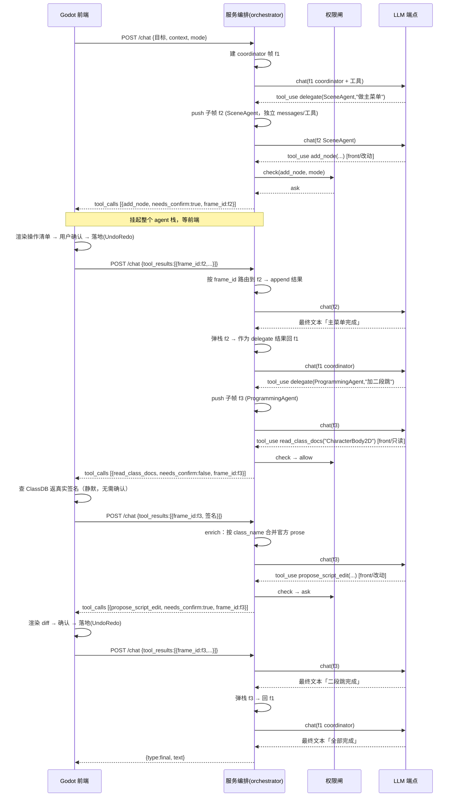

# 多智能体与权限系统 —— 详细设计

| 项目 | 内容 |
|------|------|
| 文档名称 | AI 游戏开发 Agent —— 多智能体 + 权限系统详细设计 |
| 版本 | v0.1 |
| 日期 | 2026-06-05 |
| 依据 | 《Python 服务架构方案》v0.3（§6 多智能体、§8 权限、§13 编排循环）；借鉴 Claude Code coordinator/AgentTool/权限校验 |
| 范围 | 展开两个最复杂的子系统的内部设计；HTTP 协议字段与主架构方案一致 |

---

## 1. 完整调用时序图（全链路）

以"**做一个主菜单并给玩家加二段跳**"为例，展示 coordinator → 子 agent → 权限 → 前端确认 → 跨进程 resume → 弹栈回 coordinator 的完整链路（含只读工具静默执行 + 服务端 enrich）。



**链路要点**：

- **一次 `/chat` 内可发生多轮 LLM 往复**：服务端只读工具、`delegate`（压栈）都在服务内消化；**只有前端工具（含 read-only）才中断、回到前端**。
- **挂起的是整个栈**：无论调用来自哪个帧，前端工具一出现就整栈挂起；resume 靠 `frame_id` 精确回到原帧。
- **只读工具不要确认**（`needs_confirm:false`），前端静默执行；**改动型才确认**（`needs_confirm:true`）。
- **enrich 只发生在服务端**（如 `read_class_docs` 合并 prose），前端无感。

---

## 2. 多智能体子系统详细设计

### 2.1 概念模型

```
Session
├── permission_mode / security_ctx
└── agent_stack（v1 串行：栈；后续并行：树）
    ├── Frame f1  agent=Coordinator        messages=[…]  status=running
    ├── Frame f2  agent=SceneAgent  parent=f1  messages=[…]  status=suspended
    └── …
```

- **AgentDef（静态定义）**：一个 agent 的能力画像，启动时注册，运行期不变。
- **Frame（运行实例）**：一次委派产生一个帧，含独立的 `messages`、绑定的 `AgentDef`、`parent_frame_id`、状态。
- **栈/树**：v1 同一时刻只有**栈顶帧**活跃（串行）；并行委派（多个子帧同时）列为后续（§2.8）。

### 2.2 数据结构

```python
# app/agents/types.py
from dataclasses import dataclass, field
from typing import Literal

@dataclass(frozen=True)
class AgentDef:
    id: str                       # "coordinator" | "ProgrammingAgent" | ...
    role: str                     # 用于 system prompt 的角色描述
    system_prompt: str
    tool_names: list[str]         # 该 agent 可用的工具子集（即其权限范围）
    default_skills: list[str] = field(default_factory=list)
    model: str | None = None      # 该 agent 的模型档位（None=用全局默认）
    can_delegate: bool = False    # 仅 coordinator 为 True

@dataclass
class Frame:
    id: str                       # "f2"
    agent: AgentDef
    messages: list                # 独立上下文
    parent_id: str | None
    status: Literal["running", "suspended", "done"] = "running"
    depth: int = 0
```

### 2.3 委派工具 `delegate`

仅 `can_delegate=True` 的 coordinator 拥有；它**不是前端工具也不是普通 server 工具**，而是编排层识别的特殊调用（压栈）。

```jsonc
{
  "name": "delegate",
  "description": "把一个聚焦的子任务交给某领域专家 agent 完成。仅在子任务明确属于某个领域、或需要并列推进多个独立子任务时使用；能直接用工具完成的简单单步操作不要委派。",
  "parameters": {
    "type": "object",
    "properties": {
      "agent": {"type": "string", "enum": ["ProgrammingAgent","MapAgent","SceneAgent","ResourceAgent"]},
      "task":  {"type": "string", "description": "对子任务的完整、自包含描述（子 agent 看不到主对话历史）"},
      "handoff": {"type": "string", "description": "可选：必要的上下文交接（相关节点路径、约定等）"}
    },
    "required": ["agent","task"]
  }
}
```

### 2.4 生命周期

```python
# app/orchestrator/agents.py（要点）
def on_delegate(session, args):
    parent = session.top_frame()
    if parent.depth >= MAX_DEPTH:                  # 防过深（§2.7）
        return tool_error(parent, "委派深度超限")
    child_def = AGENTS[args["agent"]]
    seed = build_subagent_system(child_def) + "\n\n任务：" + args["task"]
    if args.get("handoff"): seed += "\n交接：" + args["handoff"]
    frame = Frame(id=session.new_frame_id(), agent=child_def,
                  messages=[{"role": "system", "content": seed}],
                  parent_id=parent.id, depth=parent.depth + 1)
    session.push(frame)                            # 切换活跃帧

def on_finish(session, final_text):
    done = session.pop()                           # 子 agent 结束
    parent = session.top_frame()
    if parent is None:
        return {"type": "final", "text": final_text}   # coordinator 结束
    # 把子 agent 的结果作为 parent 那次 delegate 的工具结果
    append_tool_result(parent, parent.pending_delegate_id,
                       summarize(final_text))       # 仅回摘要，不回完整历史
```

### 2.5 上下文隔离（关键）

- 子 agent **看不到主对话历史**，只收到 `task`（+ `handoff`）——强制 coordinator 把子任务描述清楚，避免上下文串味、爆窗口。
- 子 agent 返回时**只回摘要**给 coordinator，不把其完整工具往复倒回主上下文（Claude Code 子 agent 隔离思想）。
- 子 agent 只带**本域工具子集**（`tool_names`）+ 默认 skill——这同时就是它的**权限范围**（域外工具它根本看不到）。

### 2.6 何时委派 vs 直接做

写进 coordinator 的 system prompt 的判据：

- **直接用工具**：单域、单步、能一两次工具调用解决（如"填一块草地"）。
- **委派**：跨域、复杂、或多个**相互独立**的子任务（如"做主菜单 + 玩家控制 + 测试"）。
- 明确反面例子（借鉴 Claude Code"别为单文件读起 subagent"）：不要为一次 `read_script` 或一次 `fill_rect` 起子 agent。

### 2.7 防御性约束

| 约束 | 值/策略 |
|------|------|
| 最大委派深度 | `MAX_DEPTH`（如 2；coordinator→专家，不再向下） |
| 单会话最大帧数 | 上限（防失控编排） |
| 禁止自我委派/环 | 子 agent 默认 `can_delegate=False`，从结构上无环 |
| 子 agent 失败 | 作为 `delegate` 的 `is_error` 结果回 coordinator，由其重试/换策略/上报 |

### 2.8 并行子 agent（后续，IN-6 基础）

- coordinator 一条消息里产生**多个 `delegate`** → 多个子帧。
- **难点**：前端工具确认是**单通道串行**的——多个子帧若都要前端确认，需排队（一次只弹一个）。
- 设计：服务端并行跑各子帧的**服务端工具/纯推理**部分，遇到前端工具则进入**确认队列**，前端逐个处理。
- v1 不做；M3 引入。

### 2.9 与 Skill 的绑定

- 每个 `AgentDef.default_skills` 在帧创建时把对应 skill 的简述注入其 system；agent 可 `load_skill` 取全文（渐进披露，见主方案 §11）。

---

## 3. 权限系统详细设计

### 3.1 决策三态（回顾）

`allow`（放行） / `ask`（需用户确认 → 前端预览确认） / `deny`（拒绝，回传原因让模型改）。

### 3.2 决策管线与优先级

`check(tool, args, ctx)` 按固定优先级求值，**先命中先返回**：

```
1. 安全硬闸（不可绕过）          → 越界路径 / 禁用域 / 无 shell 类     ⇒ deny
2. 显式 deny 规则               → 命中规则(effect=deny)               ⇒ deny
3. 显式 allow 规则（受信任前提） → 命中规则(effect=allow)             ⇒ allow
4. 会话级一次性授权             → 用户此前"总是允许该工具"            ⇒ allow
5. 权限模式默认                 → 见 §3.3                              ⇒ allow|ask|deny
```

> **deny 永远优先于 allow**（deny-wins）。安全硬闸在最前，任何规则/模式都无法把它放开。

```python
# app/permissions/engine.py（骨架）
def check(tool, args, ctx) -> str:          # "allow" | "ask" | "deny"
    if not security.path_ok(tool, args, ctx):        return "deny"   # 1 硬闸
    if tool.domain not in ctx.enabled_domains:       return "deny"
    if rules.match(tool, args, "deny"):              return "deny"   # 2
    if ctx.trusted and rules.match(tool, args, "allow"): return "allow"  # 3
    if ctx.session_allow.get(tool.name):             return "allow"  # 4
    return MODE_DEFAULT[ctx.permission_mode](tool)                    # 5
```

### 3.3 权限模式

| 模式 | 只读工具 | 改动型工具 | 用途 |
|------|------|------|------|
| `default` | allow | **ask** | 日常默认 |
| `plan` | allow | **deny** | 只规划不动手，先看方案 |
| `auto_approve` | allow | **allow**（仅受信任工程；仍可撤销） | 熟练用户批处理 |
| `read_only` | allow | deny | 纯分析；**MCP 入口默认** |

### 3.4 规则引擎

```python
# 规则：按 工具名 / 域 / 路径 glob 匹配
class PermRule(BaseModel):
    match: dict           # {"tool": "...", "domain": "...", "path_glob": "..."}
    effect: Literal["allow","ask","deny"]
```

- 路径类工具（写脚本/资源）会带目标路径，规则可按 `path_glob` 命中（如 `deny path_glob="addons/**"`）。
- 多规则命中时按 §3.2 优先级（deny > allow）。

### 3.5 信任模型（借鉴 Claude Code 安全/完整配置分离）

- **配置两个来源**：
  1. 服务端本地配置（用户的全局/工程外配置）——可信，可定义 allow/deny/mode。
  2. **工程内** settings（随项目走，可能来自不可信项目）——**只能收紧（deny/ask），不能提升为 allow**，也不能开 `auto_approve`。
- 未标记为**受信任**的工程：`allow` 规则与 `auto_approve` 一律被忽略/降级为 `ask`（对应 Claude Code"trust 前只用安全子集"）。
- 危险权限的提升必须来自服务端可信配置 + 用户在前端的明确信任动作。

### 3.6 与前端的契约：ask → 确认 → 可记忆授权

- `ask` ⇒ 响应里该 call `needs_confirm:true`；前端渲染 diff/操作清单。
- 用户选择：
  - **本次允许** → 前端落地，回传成功结果（一次性）。
  - **总是允许该工具/该域** → 前端额外带回一个"授权升级"标记，服务端写入 **会话级 `session_allow`**（§3.2 第 4 级），后续同类不再问。
  - **拒绝** → 回传 `is_error` + 原因，模型改方案。
- 会话级授权**不跨会话持久**（除非用户在可信配置里固化）。

### 3.7 MCP 入口的权限

- MCP 入口构造**简化上下文**：`interactive=False`、`permission_mode=read_only`（默认）。
- `ask` 无前端确认通道 ⇒ **降级为 deny**（或由 MCP 客户端自身 elicitation 处理，若支持）。
- 即：MCP 模式默认只读/分析；改动需 Godot 前端在线并走 HTTP 入口确认。

### 3.8 默认权限基线（按域/工具）

| 工具/类别 | side | mutating | default 模式下 |
|------|------|------|------|
| `read_script` / `read_scene_tree` / `read_class_docs` / `read_debugger_errors` | front | 否 | allow（静默） |
| `list_files` / `grep_code` / `search_codebase` / `read_class_docs(enrich)` | server | 否 | allow |
| `fill_rect` / `draw_*` / `set_cells` / `clear_rect` | front | 是 | ask |
| `propose_script_edit` / `add_node` / `set_node_property` / `create_resource` | front | 是 | ask |
| `set_project_setting` / `batch_rename` | front | 是 | ask（建议加 deny 规则保护关键路径） |
| `run_tests` | front | 执行 | ask（运行有副作用） |
| `delegate` | 编排 | — | 不过权限闸（内部编排） |

### 3.9 审计（可选）

- 每次 `check` 记录 `{tool, args 摘要, decision, mode, 命中规则}`，便于排查"为什么被拒/被问"。
- 落本地日志，不外传。

---

## 4. 两子系统的交汇点

| 交汇 | 说明 |
|------|------|
| 子 agent 的工具集 = 其权限范围 | 域外工具子 agent 根本看不到，权限闸再兜底 |
| 任一帧的前端工具都过同一权限闸 | `ask` 的来源帧用 `frame_id` 标注，前端确认后按 `frame_id` resume |
| `plan` 模式 × 多智能体 | coordinator 仍可委派与读、检索，但所有改动型 `deny` → 产出"方案"而非改动 |
| 信任模型 × skill | 第三方 skill 是注入 prompt 的指令，按不可信内容对待，不能借此提权（与 §3.5 一致） |

---

## 5. 待细化

| 项 | 说明 |
|----|------|
| 并行子 agent 的前端确认排队 | M3；需定义确认队列与 UI 表达 |
| 会话级授权的持久化 | 是否允许"总是允许"写入可信配置跨会话生效 |
| 规则配置的 UI | 前端是否提供权限规则编辑，还是仅文件配置 |
| 委派摘要策略 | 子 agent 结果如何摘要回 coordinator（长度/结构） |
| 审计日志范围 | 记录粒度与留存 |
